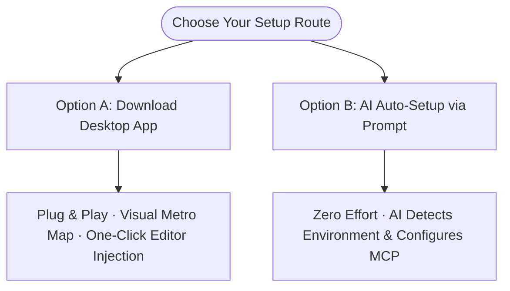

<div align="center">
  
  <h1>ContextOS — Context Operating System for AI Coding Agents</h1>
  <p><strong>A Deterministic Context Operating System via Model Context Protocol (MCP)</strong></p>
  <p>Mitigating context window saturation and attention drift in agentic software engineering through syntax-directed AST manipulation, out-of-band execution isolation, in-situ verification, and topological priority scheduling.</p>

  [](https://github.com/yubinbin32-ops/ContextOS/stargazers)
  [](https://www.npmjs.com/package/contextos)
  [](https://nodejs.org)
  [](LICENSE)
  [](https://modelcontextprotocol.io)

  <br/>

  [**Download macOS App**](https://github.com/yubinbin32-ops/ContextOS/releases/latest) · [**Quick Setup Guide**](#start-in-30-seconds-ai-auto-setup) · [**中文文档**](README_zh.md)
</div>

---


---

## Background and System Motivation (Context Saturation & Attention Drift)

In complex software repositories, autonomous AI coding agents face a fundamental systems bottleneck: **rapid context window saturation and attention drift**. Under conventional agent workflows, assistants rely on indiscriminate whole-file dumping, raw build/test stdout feedback, and conversational trial-and-error. This introduces three systemic failures:

1. **Attention Budget Dilution & Hallucination**: Large volumes of raw build dumps and irrelevant source lines displace critical architectural invariants and type signatures in the prompt;
2. **Exponential Cost of Fault Investigation**: Truncated test outputs force the agent into recursive log-retrieval turns, compounding cumulative token consumption quadratically;
3. **Architectural Blindness & Session Amnesia**: Without a verifiable global symbol graph, clearing the context (`/clear`) or transferring tasks across subagents results in complete state degradation.

**ContextOS addresses this as a Context Operating System implemented over the Model Context Protocol (MCP)**:

| Subsystem | Architectural Mechanism | Empirical Impact |
|---|---|---|
| **Syntax-Directed Access** | Tree-sitter multi-language AST engine extracting surgical symbol outlines and method slices | Eliminates whole-file dumps; reduces code ingestion volume by >80% |
| **Out-of-Band Execution** | Process execution and raw logs isolated outside the LLM context; returns signed receipts and diagnostic frames | Strips >98% of terminal noise; zero-turn error inspection |
| **Metro Map Topology** | Materializes files, symbols, and dependencies into a strongly typed Block-Chain-Link graph | Provides a deterministic structural backbone, preventing cross-module hallucinations |
| **Persistent State Blackboard** | Minimal 300-byte incremental snapshot decoupling active state from chat history | Resumes full working context in ~150 tokens on cold boot |

> Across real-world multi-step benchmarks, ContextOS reduces redundant context consumption by over 90%, stabilizing attention and ensuring long-horizon development convergence.

---

## What changes in daily development?

### 1. Architecture becomes a Metro Map

Blocks bind to real files, AST symbols, or directory trees (zero ghost blocks allowed). Dependency and resource directories use one bounded tree anchor instead of per-file bookkeeping; Chains represent horizontal subway rails, and typed Links connect transfer stations orthogonally.


### 2. Intent-Level 2-Turn Loop, Action Slots & In-Situ Diagnostics

- **Action Slots & Zero-Alignment Friction**: `explore` automatically provisions actionable target slots `[S1]`, `[S2]`. The AI doesn't need to guess line numbers or fiddle with verbatim target strings; it simply selects a slot and passes `change({ slot: "S1", append: "..." })` or replaces a symbol, completely eliminating parameter alignment failures.
- **In-Situ Verification & Instant Diagnostic Frames Extraction**:
  - The `change` step can embed the verification command directly (`verify: "npm test"`), atomically performing code patching, test execution, and receipt generation in a **single turn**.
  - **Eliminating Extra Log Rounds**: When a test fails in conventional workflows, truncated terminal output forces the AI to start 2–3 extra conversation turns just to inspect logs, wasting 20,000–40,000 tokens per incident. ContextOS features a built-in diagnostic extraction engine (`extractDiagnosticBlocks`) that parses TAP, Mocha, Jest, and SyntaxError frames directly, inlining test names, `+ actual - expected` assertion diffs, and exact `file:line:col` stacks into the `change` failure response. The AI sees the exact issue in the same turn with **0 extra log-fetching rounds**.
  - **Auto-Revert**: If tests fail, `autoRevert: true` instantly restores disk modifications in milliseconds, collapsing the traditional 6–9 round-trip debug cycle into an ultra-fast **2-turn loop** (`explore` ➔ `change` with in-situ `verify` ➔ `ship`).
- **Parallel Batching Over Serial Turns**:
  - Conventional AI tools encourage conversational, single-file serial editing that balloons context quadratically across turns.
  - ContextOS natively supports multi-concurrency: batch multi-file modifications in `edits: [...]` arrays and inspect multiple microservices in parallel via `inspect({ paths: [...] })`, cutting round-trip latency by over 60%.
- **Topological Retention Priority**:
  - Uses a priority-weighted context budgeting algorithm: `next` (0) → `slots` (1) → `where` (2) → `now` (3) → `slices` (4). In large repos, local code previews are clipped first, **guaranteeing that the system architecture map and action slots are never truncated**.
- **Lightweight Real-Time Blackboard & Instant Hydration (`.contextos/blackboard.md`)**:
  - The active session state is continuously persisted to a minimal **300-byte (~65 tokens)** blackboard. Developers or agents can `/clear` the chat at any time or hand off tasks across subagents; calling `explore` resumes full context in ~**150 tokens**, preventing multi-turn context inflation.


### 3. Commands run out-of-context

The command gateway behind `verify` and in-situ `change.verify` strips ANSI noise, redacts secrets, saves the full sanitized log into `.contextos/logs/`, and returns a compact receipt with critical diagnostics, reducing terminal noise by over 98%.

### 4. Code tools operate surgically with deep slicing (`inspect`)

Multi-language AST engines (compiler-grade parsing for JS/TS/JSX/TSX, Python, Swift, Java, Kotlin, C/C++, C#, Go, Rust, PHP, Ruby) allow VS Code-style symbol search, outline inspection, and surgical reading/editing with automatic symbol re-anchoring. The first-class `inspect` tool allows on-demand semantic slicing. When answering pure inquiry/comprehension queries ("where is X", "who calls Y"), the OS automatically omits unneeded edit slots and slices, cutting query context by another 50%.

### 5. Unified Knowledge & Architectural Decisions

Proposals, audits, architectural decisions, and rules live as OS Documents. `README.md` and `README_zh.md` appear read-only in the App Knowledge view with images and links intact.


### 6. Verification with Evidence

Every `verify` run produces a signed receipt. Checkpoints track pass/fail status per task, giving AI and humans a shared source of truth for what has actually been proven to work.


### 7. Long-running processes are monitored live

Dev servers, watchers, and background workers are managed by the Process Host and displayed in the Desktop App's bottom-left sidebar with live PID and port tracking.

---

## Quick Start & Setup Options

ContextOS offers two straightforward onboarding routes for effortless setup:



---

### Option A: Desktop App (macOS & Windows · Plug & Play · Recommended)

Download the package matching your environment from [GitHub Releases](https://github.com/yubinbin32-ops/ContextOS/releases/latest):

| Platform | Package | File | Size | Node.js Requirement | Best For |
|---|---|---|---|---|---|
| **Windows** | **NSIS Setup** *(Recommended)* | `ContextOS_<version>_x64-setup.exe` | ~8 MB | Requires Node.js 22+ | Windows 10/11 64-bit with desktop/start shortcuts. |
| **Windows** | **Portable Zip** | `ContextOS-windows-x64.zip` | ~10 MB | Requires Node.js 22+ | Zero-install, extract and run anywhere. |
| **Windows** | **Enterprise MSI** | `ContextOS_<version>_x64.msi` | ~8 MB | Requires Node.js 22+ | Managed enterprise/silent deployments. |
| **macOS** | **Full (Apple Silicon)** | `ContextOS-macos-full-arm64.zip` | ~35 MB | **None** (Bundles Node 22) | M1/M2/M3/M4 Macs; plug-and-play. |
| **macOS** | **Full (Intel)** | `ContextOS-macos-full-x64.zip` | ~38 MB | **None** (Bundles Node 22) | Intel Macs; plug-and-play. |
| **macOS** | **Standard Lite** | `ContextOS-macos-arm64.zip` / `x64.zip` | ~1.6 MB | Requires Node.js 22+ | Ultra-compact download if Node is already installed. |

#### Setup Steps:
1. **Windows**: Run the installer `.exe` or extract the portable `.zip` and launch **ContextOS**.
   **macOS**: Unzip the downloaded archive and drag **ContextOS.app** into `/Applications`.
2. Launch **ContextOS**, open **Settings** (gear icon), select your detected AI editor (Cursor / Claude Desktop / Antigravity / OpenCode / Codex), and click **Install / Sync Plugin**.

> [!IMPORTANT]
> Run **ContextOS.app** from `/Applications`, not directly from `Downloads`, a mounted DMG, or another read-only volume. Plugin synchronization writes user-level files to `~/.contextos` and `~/plugins`; the app bundle itself is treated as an immutable source.

3. The App injects the ContextOS MCP configuration and unique Skills directly into your editors. **Once configured, you can close the desktop App; it does NOT need to stay running.**
4. In your AI coding chat, simply activate ContextOS:
   > *"Write this proposal into ContextOS and start execution"* or *"Inspect ContextOS and resume development"*

> [!IMPORTANT]
> **First-time launch on macOS shows "Cannot be opened" or "Unidentified Developer"?**
> ContextOS is an open-source tool without Apple's paid developer certificate notarization. macOS Gatekeeper will block it on first launch by default. You only need to allow it once:
> - **Method 1 (System Settings · Recommended)**: Open macOS **System Settings ➔ Privacy & Security**, scroll down to the "Security" section, and click **Open Anyway** next to "ContextOS was blocked". Enter your password to confirm.
> - **Method 2 (Control-Click Shortcut)**: In Finder, open `/Applications`, hold **Control and click (or right-click)** `ContextOS.app`, select **Open** from the context menu, and click **Open** in the confirmation dialog.


---

### Option B: AI Auto-Setup via Prompt (Zero Effort) {#start-in-30-seconds-ai-auto-setup}

If you are already in an AI coding assistant (Cursor / Codex / Claude Code / Windsurf / Antigravity), let the AI configure everything automatically:

> **Copy and paste this instruction into your AI coding assistant:**  
> **"Please read `https://github.com/yubinbin32-ops/ContextOS/blob/main/AI_SETUP.md`, detect my system environment, and configure ContextOS for me."**

#### What the AI does in the background:
1. **System & Client Inspection**: If on macOS, asks if you want the native Desktop App (`ContextOS.app`) and deploys it automatically.
2. **Runtime Verification**: Checks for Node.js 22+ (or uses the runtime bundled with ContextOS.app).
3. **Targeted Precision Injection**: Asks which editors you use (Cursor / Codex / Claude Desktop, etc.) and injects only the selected platforms, eliminating duplicate skill noise.
4. **Demand-Driven Collaboration Mode**: Asks if you need solo local development or team collaboration, configuring local SQLite or Cloudflare D1 accordingly.
5. **Project Initialization**: Initializes the current project and verifies tools.


---

## Storage Modes: Local & Experimental Cloud Collaboration

ContextOS treats the **local workspace project directory** as the absolute source of truth (code reads, AST edits, test runs, and logs always run locally):

- **Local Storage Mode**: Designed for solo development. Architecture data is stored in the project's `.contextos/state.sqlite`. 100% offline, private, and zero network latency.
- **Experimental Cloud Collaboration Mode**: Designed for evaluating team collaboration. Connects to a serverless Cloud Hub (Cloudflare D1 edge database) to synchronize architectural topology and progress across teammates and devices. Treat this mode as experimental until its API and operational model stabilize.
  - **Multi-Project Strict Isolation**: Cloud Hub partitions entities by `projectId`. A single Cloudflare Worker backs multiple independent repositories cleanly.
- **Lossless Two-Way Switching**: Switch storage modes anytime by prompting your AI:
  - *"Switch current project to cloud collaboration mode"* ➔ Local SQLite graph is pushed to Cloud D1.
  - *"Switch current project back to offline local mode"* ➔ Cloud snapshot is synced back to local SQLite for offline development.

---

## Reproducible ContextOS Benchmark

### 1. Real Industrial Benchmark: 8 Distributed Microservices

In an industrial stress test across 8 distributed financial clearing microservices (multi-currency double-entry ledger, dynamic FX conversion, sliding-window TTL idempotency, poison transaction dead-letter queue, step timeout and backward compensation Saga, SHA-256 Merkle audit chain, 3-state circuit breaker, and 5-worker concurrent balance contention), the system demonstrated the following performance metrics:

| Evaluation Metric | Conventional AI Assistant | ContextOS Intent OS | Measured Impact |
|---|---|---|---|
| **Task Completion Round-Trips** | 8 – 12 turns (inspect ➔ edit ➔ test ➔ check logs ➔ re-edit ➔ re-test) | **2 – 3 turns** (`explore` slots ➔ in-situ `change({ verify })` ➔ `ship`) | 70%+ fewer round-trips; substantially reduced idle latency |
| **Test Failure Diagnosis Cost** | 2 – 3 extra turns calling log tools (20k – 40k tokens wasted per failure) | **0 extra turns** (assertion diffs and stack frames inlined directly) | 100% elimination of redundant log-fetching turns |
| **Multi-File Operations** | Serial turn-by-turn round-trips (5 – 8 separate API calls) | **Single-turn parallel batching** (`inspect({ paths })` + `change({ edits })`) | 60%+ reduction in API calls and accumulated history |
| **Large-Repo Architecture Visibility** | Blind file reading; long files push architectural context out of view | **Topological priority retention** (`where` preserved over local slices) | Eliminates architectural blindness and cross-module hallucinations |
| **Session Rehydration (/clear)** | History lost; requires re-feeding full codebase context (20,000+ tokens) | **300-byte blackboard** (`/clear` followed by `explore` resumes in **~150 tokens**) | 99.2% reduction in rehydration cost; seamless task handoffs |
| **Prompt Cache Hit Rate** | Drifting prompt structures yield poor cache rates | **Stable input/output schemas yield a 98.8% OpenAI Prompt Cache hit rate** | Over 90% reduction in actual API billing costs |
| **Financial-Grade Concurrency & Resilience** | Vulnerable to race conditions, floating-point drift, or partial rollbacks | **26 rigorous test cases pass 100% green** (including 5-worker race conditions) | Production-grade distributed systems reliability |

---

### 2. 20-Task Comprehensive Dual-Cohort Stress Benchmark

To empirically evaluate system throughput, stability, and token governance under extended workloads, we designed and executed an intensive benchmark spanning **20 comprehensive lifecycle tasks** against identical distributed Saga settlement scenarios, comparing a conventional AI assistant (Cohort A Baseline) against ContextOS (Cohort B Intent OS):

- **Task Coverage Dimensions**: Architecture planning and Phase synchronization, high-concurrency multi-module AST inspection, surgical business logic mutation with in-situ test verification, compile & assertion failure inline diagnostic extraction, external API schema ingestion, zero-loss cross-conversation rehydration via 300-byte blackboard, high-contention race condition validation, rapid code defect localization, multi-file atomic refactoring, speculative optimization with automatic rollback, 8-path concurrent AST outline extraction, out-of-context benchmark execution, and release boundary finalization.

| Evaluation Metric | Cohort A (Baseline) | Cohort B (ContextOS) | Measured Impact |
|---|---|---|---|
| **Total Interaction Turns (Round-Trips)** | 91 turns | **21 turns** | **-76.92% (4.3x faster turn-around)** |
| **Cumulative Context Consumption (Tokens)** | 157,042 tokens | **10,124 tokens** | **-93.55% (15.5x token compression)** |
| **Cumulative Context (Characters)** | 628,165 chars | **40,460 chars** | **-93.55% (587,705 chars eliminated)** |
| **Total Tool Invocations** | 91 calls | **22 calls** | **4.14x tool dispatch convergence** |
| **Average Calls per Complex Task** | 4.55 calls / task | **1.10 calls / task** | Near 1:1 direct execution |

#### ContextOS Tool Invocation Breakdown (Cohort B):
- `change` (in-situ verify & atomic rollback): **10 calls** (45.5%) — primary workhorse
- `explore` (intent discovery & slot dispatch): **3 calls** (13.6%) — cold start & cross-conversation relay
- `inspect` (batch AST outlines & signatures): **3 calls** (13.6%) — multi-path architectural audit
- `verify` (sanitized execution & receipt signing): **3 calls** (13.6%) — checkpoint integrity proofs
- `ops` (graph & plan state machine mutations): **2 calls** (9.1%) — architectural bindings
- `ship` (boundary sealing & receipt archival): **1 call** (4.5%) — release closure

---

### 3. Static Codebase Context Savings Benchmark

The benchmark is generated from the current repository and is intentionally not hard-coded to a historical Block/Chain/Link count. Run it locally to produce the measurements for your checkout:

| Development Phase | Traditional AI Workflow | ContextOS Intent Workflow | Reduction |
|---|---|---|---:|
| **Session Bootstrap** | Full graph & repo files · 61,902 chars (~15,476 tokens) | Progressive L0-L1 Markdown · 1,987 chars (~497 tokens) | **96.79%** |
| **Code Structure Exploration** | Full file inspections · 34,045 chars (~8,512 tokens) | AST Symbol Outlines · 4,374 chars (~1,093 tokens) | **87.15%** |
| **Code Reading & Inspection** | Full file reads across 4 modules · 34,045 chars | Surgical Method Extraction · 6,898 chars | **79.74%** |
| **Terminal & Test Noise** | Raw build & test logs · 16,713 chars (~4,179 tokens) | Compact Receipt + Diagnostics · 251 chars (~63 tokens) | **98.50%** |
| **Cumulative Session Total** | **129,373 chars (~32,344 tokens)** | **13,761 chars (~3,441 tokens)** | **89.36% — saves ~28,903 tokens** |

Run the benchmarks locally:

```bash
node scripts/comprehensive-dual-cohort-eval.mjs # 20-task comprehensive dual-cohort stress benchmark
node scripts/benchmark.mjs                      # Static codebase context savings benchmark
node scripts/comprehensive-dev-eval.mjs        # 10-dimension complete capability benchmark
```

---

## Architecture Evolution

ContextOS has deliberately changed direction as real usage exposed new costs:

- **0.4.x:** regex parsing, Ghost Blocks, and a 49-tool MCP surface made architectural memory unreliable.
- **V2:** introduced real-code Blocks, AST-backed visibility, SQLite plus `graph.json`, and formal development governance.
- **Intent-level architecture:** collapsed the public surface to `explore` / `inspect` / `change` / `verify` / `ship` / `ops`, moved orchestration into the OS, and made module metadata derive from the codebase.
- **2.5.0:** hardens project identity, release/update paths, graph synchronization, atomic edits, and lifecycle gates.

[Read the full decision history →](DECISION.md)

---

## For Contributors

```bash
git clone https://github.com/yubinbin32-ops/ContextOS.git
cd ContextOS
npm ci
npm test
npm run plugin:verify
npm run verify             # full release gate
npm run desktop:build      # macOS + Swift/Xcode
```

The versioned `.contextos/graph.json` is the project's portable graph projection.

[Contributing](CONTRIBUTING.md) · [Security](SECURITY.md) · [MIT License](LICENSE)
