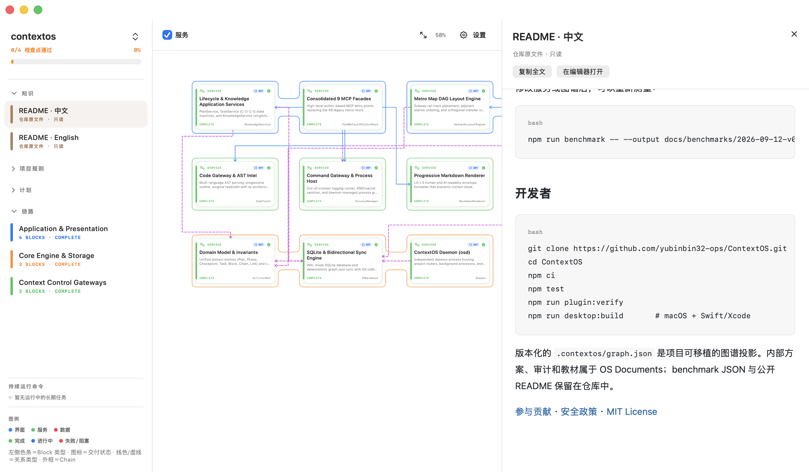
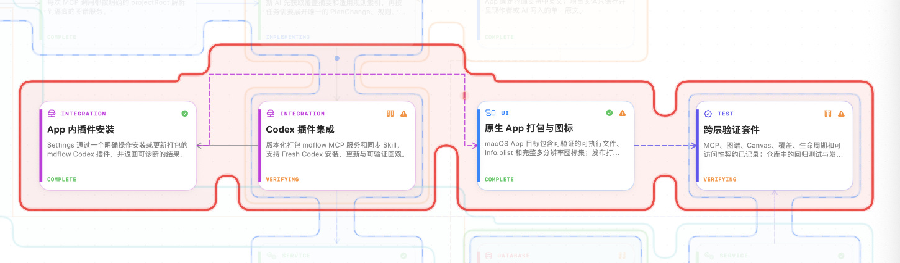
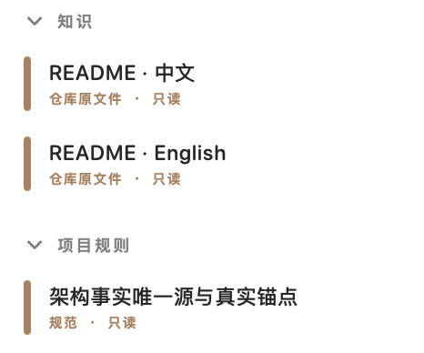
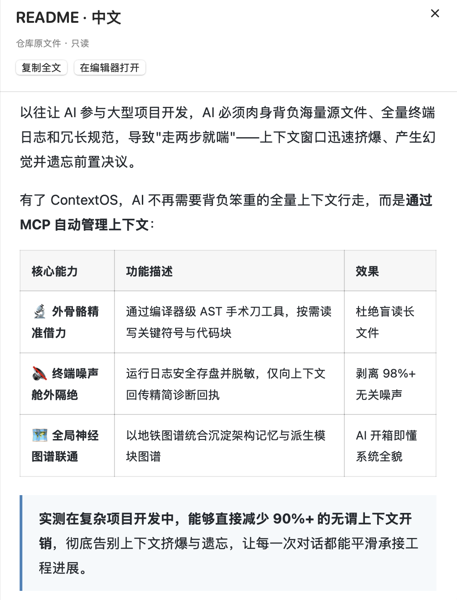
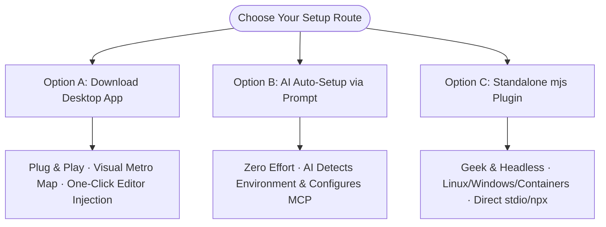
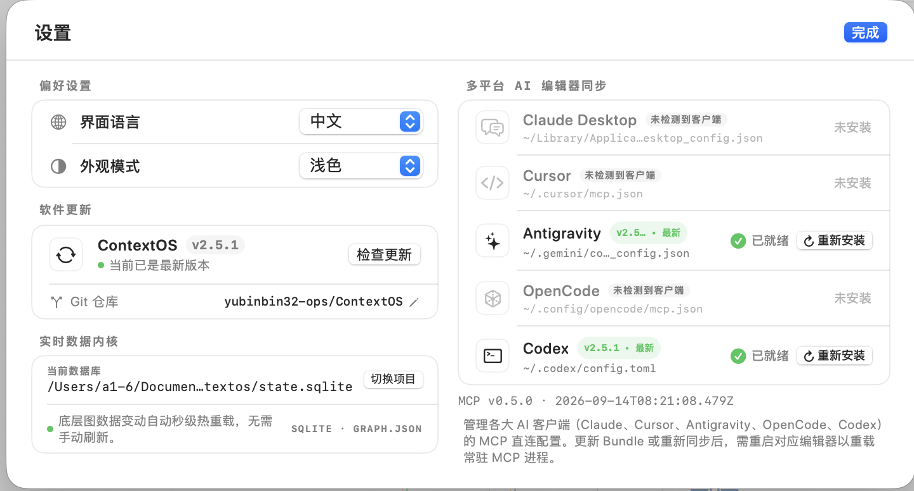

<div align="center">
  
  <h1>A High-Precision Powered Exoskeleton for AI Coding</h1>
  <p><strong>Auto-governing context via MCP, reducing context window waste by 90%+ in practice.</strong></p>
  <p>Stopping context window explosion and hallucination in large codebases: surgical AST read/write instead of dumping whole files, out-of-context command receipts, and an intuitive Metro Map architecture.</p>
  <p><a href="https://github.com/yubinbin32-ops/ContextOS/releases/latest"><strong>Download macOS Desktop App</strong></a> · <a href="#start-in-30-seconds-ai-auto-setup">Start in 30 seconds</a> · <a href="README_zh.md">中文文档</a></p>
</div>


## What problem does ContextOS solve?

**ContextOS acts as a high-precision powered exoskeleton for AI coding assistants**:
In traditional workflows with large repositories, an AI agent is forced to haul massive raw files, noisy build dumps, and repetitive documentation in its prompt. It quickly runs out of breath — the context window explodes, hallucinations multiply, and previous design decisions are forgotten.

With ContextOS, the AI sheds the deadweight and lets the **MCP protocol auto-govern context**:
1. **Exoskeleton-Powered Precision**: Compiler-grade AST tools surgically inspect and edit only the relevant symbols and syntax blocks, eliminating whole-file dumps;
2. **Out-of-Context Isolation**: Terminal logs are safely captured to a sandboxed disk store, returning compact diagnostic receipts to strip 98%+ of terminal noise;
3. **Unified Neural Metro Map**: Architectural memory and the derived module graph are synchronized in a visual subway map, giving the AI immediate full-picture clarity.

**In real-world multi-step tasks, ContextOS reduces redundant context consumption by over 90%**, eliminating context explosion and memory loss across long-running sessions.



## What changes in daily development?

### 1. Architecture becomes a Metro Map
Blocks bind to real files, AST symbols, or directory trees (zero ghost blocks allowed). Dependency and resource directories use one bounded tree anchor instead of per-file bookkeeping; Chains represent horizontal subway rails, and typed Links connect transfer stations orthogonally. The agent understands the big picture without touching the code.



### 2. The agent states intent, the OS runs the loop
The agent only calls `explore` → `change` → `verify` → `ship`. The OS derives the working set from git, files code under AST-derived modules, attaches verification receipts automatically and keeps every response inside a context budget. Coverage and evidence gates are advisory by default; `strict: true` in `.contextos/profile.json` restores hard enforcement.

### 3. Commands run out-of-context
The command gateway behind `verify` and `ops` strips ANSI noise, redacts secrets, saves the full sanitized log into `.contextos/logs/`, and returns a compact receipt with critical error diagnostics, reducing terminal noise by over 98%.

### 4. Code tools operate surgically
Multi-language AST engines (compiler-grade parsing for JS/TS/JSX/TSX, Python, Swift, Java, Kotlin, C/C++, C#, Go, Rust, PHP, Ruby) allow VS Code-style symbol search, outline inspection, and surgical reading/editing with automatic symbol re-anchoring.

### 5. Unified Knowledge & Architectural Decisions
Proposals, audits, architectural decisions, and rules live as OS Documents. `README.md` and `README_zh.md` appear read-only in the App Knowledge view with images and links intact.



### 6. Long-running processes are monitored live
Dev servers, watchers, and background workers are managed by the Process Host and displayed in the Desktop App's bottom-left sidebar with live PID and port tracking.



## Quick Start & Setup Options

ContextOS offers three flexible onboarding options for any workflow:



---

### Option A: macOS Desktop App (Plug & Play · Recommended)

Download the package matching your environment from [GitHub Releases](https://github.com/yubinbin32-ops/ContextOS/releases/latest):

| Package | File | Size | Node.js Requirement | Best For |
|---|---|---|---|---|
| **Full Standalone** *(Recommended)* | `ContextOS-macos-full.zip` | ~35 MB | **None** (Bundles standalone Node 22) | Zero-setup, plug-and-play. Ideal if you don't have Node installed. |
| **Standard Lite** | `ContextOS-macos.zip` | ~1.6 MB | Requires Node.js 22+ on system | Ultra-compact download if you already have Node installed. |

#### Setup Steps:
1. Unzip the downloaded archive and drag **ContextOS.app** into `/Applications`.
2. Launch **ContextOS**, open **Settings** (gear icon or `Cmd+,`), select your detected AI editor (Cursor / Claude Desktop / Antigravity / OpenCode / Codex), and click **Install / Sync Plugin**.
3. The App injects the ContextOS MCP configuration and unique Skills directly into your editors. **Once configured, you can close the desktop App; it does NOT need to stay running.**
4. In your AI coding chat, simply activate ContextOS:
   > *"Write this proposal into ContextOS and start execution"* or *"Inspect ContextOS and resume development"*

> [!IMPORTANT]
> **First-time launch on macOS shows "Cannot be opened" or "Unidentified Developer"?**
> ContextOS is an open-source tool without Apple's paid developer certificate notarization. macOS Gatekeeper will block it on first launch by default. You only need to allow it once:
> - **Method 1 (System Settings · Recommended)**: Open macOS **System Settings ➔ Privacy & Security**, scroll down to the "Security" section, and click **Open Anyway** next to "ContextOS was blocked". Enter your password to confirm.
> - **Method 2 (Control-Click Shortcut)**: In Finder, open `/Applications`, hold **Control and click (or right-click)** `ContextOS.app`, select **Open** from the context menu, and click **Open** in the confirmation dialog.



---

### Option B: AI Auto-Setup via Prompt (Zero Effort)

If you are already in an AI coding assistant (Cursor / Codex / Claude Code / Windsurf / Antigravity), let the AI configure everything automatically:

> **Copy and paste this instruction into your AI coding assistant:**  
> **"Please read `https://github.com/yubinbin32-ops/ContextOS/blob/main/AI_SETUP.md`, detect my system environment, and configure ContextOS for me."**

#### What the AI does in the background:
1. **System & Client Inspection**: If on macOS, asks if you want the native Desktop App (`ContextOS.app`) and deploys it automatically.
2. **Runtime Verification**: Checks for Node.js 22+ (or uses the runtime bundled with ContextOS.app).
3. **Targeted Precision Injection**: Asks which editors you use (Cursor / Codex / Claude Desktop, etc.) and injects only the selected platforms, eliminating duplicate skill noise.
4. **Demand-Driven Collaboration Mode**: Asks if you need solo local development or team collaboration, configuring local SQLite or Cloudflare D1 accordingly.
5. **Project Initialization**: Initializes the current project and verifies tools.

---

### Option C: Standalone `contextos-mcp.mjs` Plugin (Headless / Linux / Geek)

> [!NOTE]
> Ideal for Linux, Windows CLI, Docker containers, remote SSH servers, or headless CI environments without a desktop GUI.
> **Requirement**: Node.js >= 22.

#### 1. Run directly with npx
```bash
npx -y github:yubinbin32-ops/ContextOS
```

#### 2. Download the pre-bundled single-file plugin
Download the compiled single-file bundle from the repository: [`plugins/contextos/server/contextos-mcp.mjs`](plugins/contextos/server/contextos-mcp.mjs).

Add standard stdio MCP configuration to your editor (`mcp.json` or `claude_desktop_config.json`):
```json
{
  "mcpServers": {
    "contextos": {
      "command": "node",
      "args": ["/absolute/path/to/plugins/contextos/server/contextos-mcp.mjs"]
    }
  }
}
```

---

## Storage Modes: Local & Experimental Cloud Collaboration

ContextOS treats the **local workspace project directory** as the absolute source of truth (code reads, AST edits, test runs, and logs always run locally):

- **Local Storage Mode**: Designed for solo development. Architecture data is stored in the project's `.contextos/state.sqlite`. 100% offline, private, and zero network latency.
- **Experimental Cloud Collaboration Mode**: Designed for evaluating team collaboration. Connects to a serverless Cloud Hub (Cloudflare D1 edge database) to synchronize architectural topology and progress across teammates and devices. Treat this mode as experimental until its API and operational model stabilize.
  - **Multi-Project Strict Isolation**: Cloud Hub partitions entities by `projectId`. A single Cloudflare Worker backs multiple independent repositories cleanly.
- **Lossless Two-Way Switching**: Switch storage modes anytime by prompting your AI:
  - *"Switch current project to cloud collaboration mode"* ➔ Local SQLite graph is pushed to Cloud D1.
  - *"Switch current project back to offline local mode"* ➔ Cloud snapshot is synced back to local SQLite for offline development.

## Architecture Evolution

ContextOS has deliberately changed direction as real usage exposed new costs:

- **0.4.x:** regex parsing, Ghost Blocks, and a 49-tool MCP surface made architectural memory unreliable.
- **V2:** introduced real-code Blocks, AST-backed visibility, SQLite plus `graph.json`, and formal development governance.
- **Intent-level architecture:** collapsed the public surface to `explore` / `change` / `verify` / `ship` / `ops`, moved orchestration into the OS, and made module metadata derive from the codebase.
- **2.5.0:** hardens project identity, release/update paths, graph synchronization, atomic edits, and lifecycle gates.

[Read the full decision history](DECISION.md).

## Reproducible ContextOS Benchmark

The benchmark is generated from the current repository and is intentionally not hard-coded to a historical Block/Chain/Link count. Run it locally to produce the measurements for your checkout:

| Development Phase | Traditional AI Workflow | ContextOS Intent Workflow | Reduction Rate |
|---|---|---|---:|
| **Session Bootstrap (Ingestion)** | Read full graph & repo files (61,902 chars / ~15,476 tokens) | Progressive L0-L1 Markdown (1,987 chars / ~497 tokens) | **96.79%** |
| **Code Structure Exploration** | Full file inspections (34,045 chars / ~8,512 tokens) | AST Symbol Outlines (4,374 chars / ~1,093 tokens) | **87.15%** |
| **Code Reading & Inspection** | Full file reads across 4 modules (34,045 chars) | Surgical Method Extraction (6,898 chars) | **79.74%** |
| **Terminal & Test Noise** | Raw build & test logs (16,713 chars / ~4,179 tokens) | Compact Receipt + Diagnostics (251 chars / ~63 tokens) | **98.50%** |
| **Cumulative Session Total** | **129,373 chars (~32,344 tokens)** | **13,761 chars (~3,441 tokens)** | **89.36% (~28,903 tokens saved)** |

Run the benchmarks locally:

```bash
node scripts/benchmark.mjs
node scripts/practical-test.mjs
node scripts/e2e-project-lifecycle.mjs
node scripts/comprehensive-dev-eval.mjs
```

## For contributors

```bash
git clone https://github.com/yubinbin32-ops/ContextOS.git
cd ContextOS
npm ci
npm test
npm run plugin:verify
npm run verify             # full release gate
npm run desktop:build      # macOS + Swift/Xcode
```

The versioned `.contextos/graph.json` is the project's portable graph projection.

[Contributing](CONTRIBUTING.md) · [Security](SECURITY.md) · [MIT License](LICENSE)
