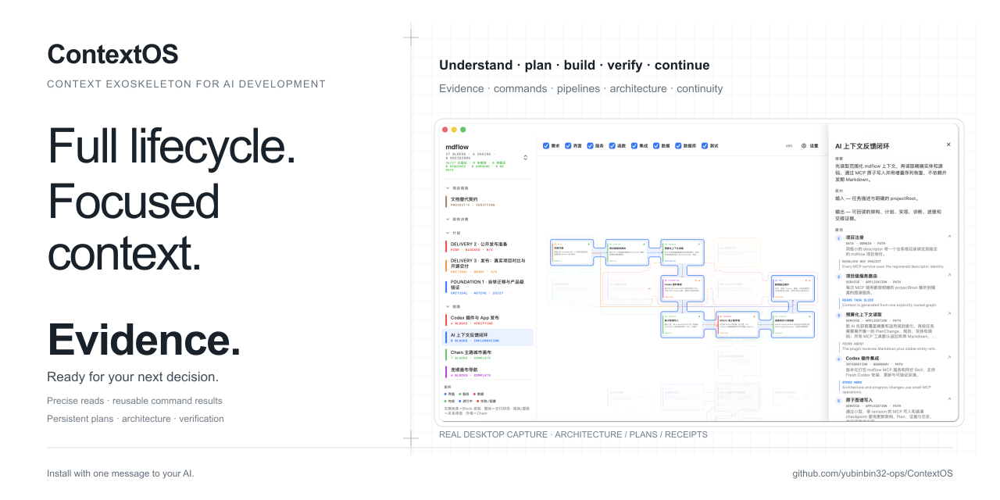
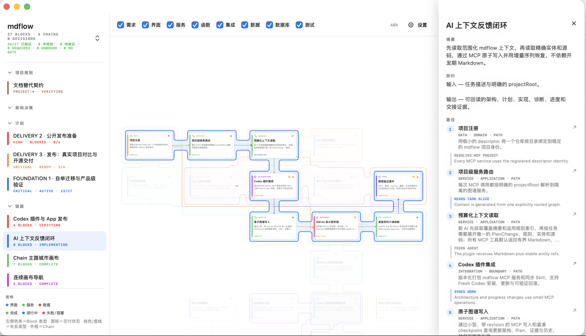
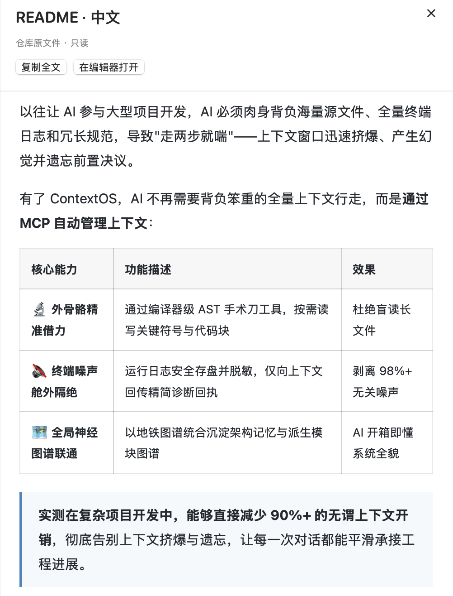
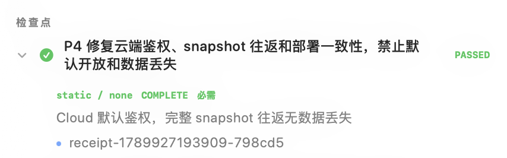
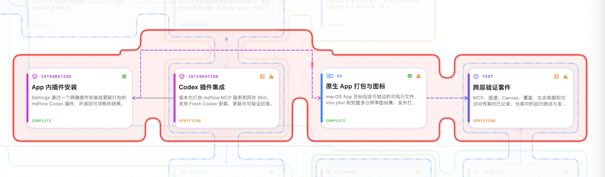
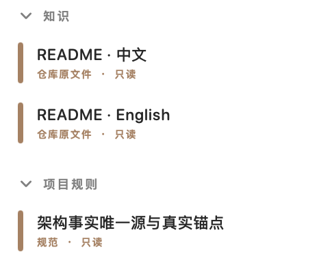
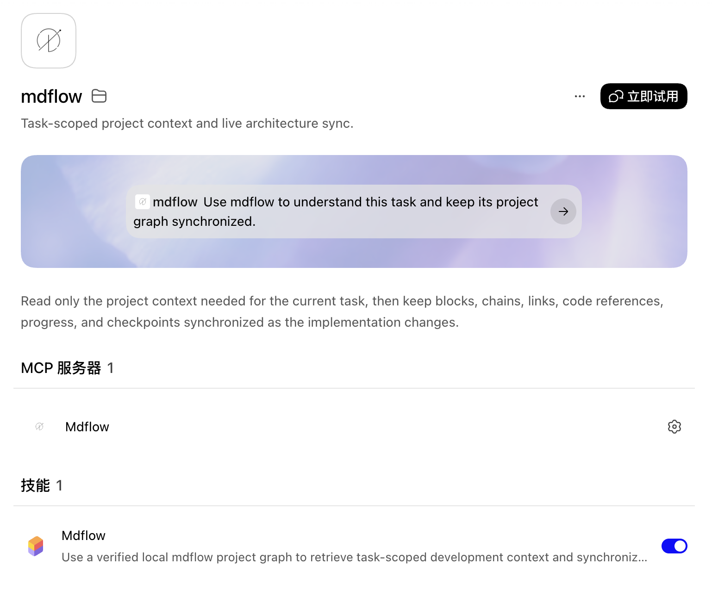
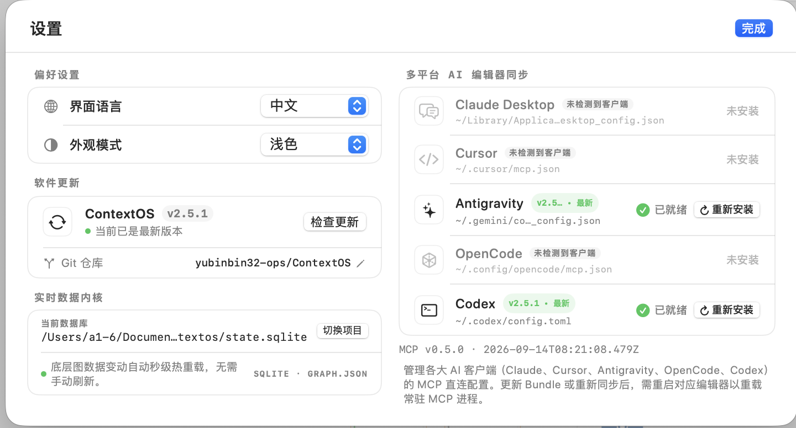

<div align="center">
  
  <h1>ContextOS</h1>
  <p><strong>Context Exoskeleton for AI Coding Agents: Offloading Evidence, Commands, Edits, and Architecture State</strong></p>

[](https://github.com/yubinbin32-ops/ContextOS/releases/latest)
[](https://github.com/yubinbin32-ops/ContextOS/stargazers)
[](https://nodejs.org)
[](LICENSE)

<p>Current Version: <span id="contextos-version">2.7.2</span> · Local MCP runtime · AST slices · Verification receipts · Persistent project state</p>

[**Download & Installation**](#5-download--installation) · [**Empirical Evaluation**](#4-empirical-evaluation) · [**Solution & System Capabilities**](#3-solution--system-capabilities) · [**Releases**](https://github.com/yubinbin32-ops/ContextOS/releases) · [**中文**](README_zh.md)
</div>


*Figure 1: Project overview and core architectural metrics of ContextOS context exoskeleton.*

---

## 1. System Definition

**ContextOS** is a **context exoskeleton management system** designed as an underlying development scaffold for AI coding agents. In conventional agent workflows, all operations—including source file exploration, terminal command executions, test runner log outputs, and exploratory trial-and-error edits—are streamed directly into the primary conversational context window. This quickly exhausts context budgets, causes attention dilution, and inflates reasoning costs.

ContextOS decouples mechanical execution from semantic reasoning. By establishing an externalized execution layer between the AI agent and the codebase, ContextOS offloads evidence retrieval, command execution, atomic source modifications, and architectural state outside the main chat session. The primary agent receives only deterministic AST slices, durable execution receipts, and targeted failure diagnostics, ensuring a lean, focused, and persistent development loop.


*Figure 2: End-to-end workflow demonstration of ContextOS managing agent execution and architecture canvas.*

---

## 2. Problem Analysis

Contemporary autonomous coding agents struggle with systemic bottlenecks when operating directly within conventional terminal and conversational environments:

1. **Full-File Ingestion and Log Flooding**:
   Standard file inspection tools dump entire source files into the conversation history to inspect small symbol definitions. Furthermore, build systems and test suites produce thousands of lines of verbose stdout/stderr logs. Injecting these raw streams directly into the conversation consumes tens of thousands of tokens in a single turn, degrades attention on system instructions, and forces early context window truncation.
2. **Multi-Turn Command Execution and Conversational Pollution**:
   Complex development cycles require multiple intermediate commands (`lint`, `typecheck`, `test`, `build`). Standard agent loops execute these across sequential conversational turns. Each round appends request/response payloads to the conversation history, permanently inflating the input context for all future turns and causing conversational drift.
3. **Mutation Drift and Architectural Erosion**:
   Unconstrained LLMs performing direct code edits frequently modify out-of-scope files or internal helper functions without immediate regression testing. Lacking explicit structural boundaries or ownership models, agents cause architectural drift, violate interface contracts, and introduce regressions across module boundaries.
4. **Cross-Session Progress Amnesia**:
   When conversational context limits are reached or an agent session resets, all accumulated understanding—including discovered dependencies, executed commands, and task milestones—is lost. The incoming agent session must redundantly re-scan directories and re-read code, wasting significant token budgets and risking inconsistent architectural decisions.
5. **Frontier Model Economic Inefficiency**:
   Directing routine mechanical tasks—such as file searching, command log inspection, and repetitive syntax checks—to expensive flagship frontier models dramatically increases financial cost without improving solution quality.

---

## 3. Solution & System Capabilities

ContextOS provides a comprehensive execution layer to resolve these limitations. The system exposes a unified MCP interface `contextos({ action, args, projectRoot })` backed by a local runtime and a visual architecture desktop environment.


*Figure 3: Desktop Block/Chain subway-style architecture canvas and real-time context feedback inspector.*

### 3.1 Deterministic Evidence Retrieval & Result Reuse (`ask` / `inspect`)
ContextOS replaces entire-file reads with deterministic AST symbol slicing and exact line boundaries (`ask` with `inspect: [{ path, ranges: [[first, last]] }]`).
- Queries return only the exact syntax nodes and cryptographically verifiable content hashes.
- Evidence references are indexed via `resultId`. When an agent re-inspects code, ContextOS validates whether the underlying file has changed; if identical, it emits an `unchanged` receipt with zero redundant source body tokens, eliminating repeated context ingestion.


*Figure 4: In-app README reader and capability inspection table.*

### 3.2 Local Durable Receipts & Log Offloading (`command`)
Rather than streaming raw terminal logs into the conversation window, `command` executes processes in isolated local subprocesses.
- Verbose stdout and stderr streams are persisted directly to local disk storage as durable receipts.
- The agent receives a compact receipt containing execution status, exit code, duration, and focused summaries.
- Historical execution outputs can be queried by `id` (`command({ action: "get", id })`) at any time, avoiding re-executing commands simply to recover diagnostic output.


*Figure 5: Checkpoint verification receipt displaying passed status and compact diff details.*

### 3.3 Batch Serial & Parallel Pipelines (`pipeline`)
To eliminate multi-turn conversational back-and-forth, `pipeline` allows the agent to chain or parallelize multiple actions (`inspect`, `change`, `verify`, `command`, `run`) in a single invocation.
- Steps execute sequentially or concurrently within the local runtime.
- The host agent receives a unified outcome payload in a single conversational turn, collapsing latency and eliminating round-trip message accumulation.

### 3.4 Atomic Verified Modifications & Block Ownership (`change` + `verify`)
ContextOS enforces disciplined mutations through atomic transactions:
- **Coupled Verification**: Every source modification (`edits: [{ path, target, replacement }]`) can attach verification suites (`verify: ["npm test"]`). If verification fails, the runtime can immediately roll back changes (`autoRevert: true`).
- **Architectural Block Ownership**: Curated project files are mapped into architectural Blocks and Chains. Files within architectural boundaries cannot be modified without explicit Block ownership, preventing unexpected cross-module drift.


*Figure 6: Impact path highlighting across architectural boundaries and dependency chains.*

### 3.5 Cross-Session Continuity & Persistent State Graph (`plan` / `task` / `session`)
Development state is persisted in `.contextos/` rather than lost between conversational turns:
- **State Blackboard**: The runtime records user intent, task breakdowns (`plan`, `task`), touched files, and verification receipts, automatically generating and maintaining `.contextos/blackboard.md`.
- **Zero Cold-Start Exploration**: New agent sessions immediately ingest the persistent architecture graph and progress status through `ops({ capability: "session", action: "status" })`, resuming implementation without re-exploring the codebase.


*Figure 7: Knowledge list view organizing project READMEs, architecture specs, and operational rules.*

### 3.6 Two-Tier Delegation Architecture (`api-micro` & `cli-agent`)
ContextOS provides flexible delegation paths to keep the main conversation lean:
- **API Micro**: A lightweight, synchronous executor designed for semantic code discovery, evidence retrieval, bounded commands, and verification batches. It returns concise, host-ready summaries directly to the caller.
- **CLI Agent**: An isolated subagent adapter designed for multi-step refactoring and complex repairs requiring independent tool loops. Dispatched with `background: true` to prevent host tool call timeouts (e.g. AGY ~3 minutes).
- **Session Retention & 233k Rule**: Up to 5 completed sessions are retained for continuation (`sessionId` / `cliSessionId`). When tasks are coherent, sessions are reused; once CLI context consumption reaches the 233k token window threshold, or when an independent task begins, a fresh session is spawned to maintain peak model attentiveness.


*Figure 8: Plugins view showing local MCP server registration and Skill installation.*


*Figure 9: Multi-platform MCP and Skill synchronization across Codex, Claude, Cursor, Antigravity, and OpenCode.*

---

## 4. Empirical Evaluation

To evaluate ContextOS rigorously under realistic software engineering conditions, an empirical benchmark was conducted on a non-trivial development task.

### 4.1 Methodology & Experimental Controls

This evaluation was rerun on final commit `0dd6431` with durable raw evidence. Four isolated Git worktrees were created from the same commit, and four fresh host conversations received the same real development task: implement plan dependency management, including add, remove, and list actions; persistence; unknown-target, self-reference, duplicate, and cycle rejection; MCP routing and read/mutation classification; and focused domain, application, storage, and MCP tests.

The four arms were:

- **A (native baseline)**: native file and shell tools only.
- **B (OS only)**: ContextOS primitives only, without API Micro or the CLI agent.
- **C (OS + Micro)**: ContextOS primitives with API Micro for bounded exploration and verification.
- **D (OS + Micro + CLI)**: ContextOS primitives, API Micro, and CLI delegation for the multi-file implementation.

All four arms were independently rerun after completion. Arms A, B, and C passed 778 of 778 tests. Arm D passed 781 of 781 tests. Every arm produced a real implementation diff, and no arm modified the main repository or README during the experiment.

Metrics use the following definitions:

- `raw`: `input + output`, including cached input reads; diagnostic only.
- `peak`: peak single-request input tokens.
- `weighted cost`: `cached input * 0.1 + uncached input * 2 + output * 10`.
- `main-equivalent cost`: main weighted cost plus API Micro and CLI weighted cost divided by 7.

### 4.2 Benchmark Results

| Arm | main raw | micro raw | CLI raw | total raw | main-equivalent cost | vs A | peak context | peak vs A | main requests | tests |
| :--- | ---: | ---: | ---: | ---: | ---: | :---: | ---: | :---: | ---: | :---: |
| **A native** | 8,016,375 | 0 | 0 | 8,016,375 | 1,623,055.6 | - | 234,174 | - | 47 | 778/778 |
| **B OS only** | 6,119,582 | 0 | 0 | 6,119,582 | 1,315,797.6 | **-18.9%** | 184,507 | **-21.2%** | 50 | 778/778 |
| **C OS + Micro** | 4,993,135 | 734,551 | 0 | 5,727,686 | 1,413,765.0 | **-12.9%** | 145,694 | **-37.8%** | 50 | 778/778 |
| **D OS + Micro + CLI** | 1,809,566 | 3,258,709 | 4,393,118 | 9,461,393 | 790,090.1 | **-51.3%** | 84,681 | **-63.8%** | 29 | 781/781 |

Arm D reduced main-thread raw tokens by 77.4% and peak context by 63.8% relative to Arm A. Its total raw token count is higher because the CLI worker consumed 4.39M raw tokens, but the worker's weighted cost is divided by 7 and the main thread avoided the multi-file implementation work. Arm B and Arm C both reduced cost and context, but API Micro did not improve this task enough to beat the simpler OS-only arm: Arm C used 734,551 additional Micro raw tokens and finished at 1,413,765.0 main-equivalent cost versus 1,315,797.6 for Arm B.

### 4.3 Codex vs AGY CLI Adapters

The same bounded plan-dependency task was dispatched through ContextOS to two explicit CLI adapters on commit `0dd6431`: `adapter: "codex"` and `adapter: "agy"`. Both completed the feature and passed 777 of 777 tests. AGY also made four API Micro calls during its run.

| Adapter | tests | CLI raw | micro raw | total raw | main-equivalent cost | peak context | peak usage | report quality |
| :--- | :---: | ---: | ---: | ---: | ---: | ---: | ---: | :--- |
| **Codex CLI** | 777/777 | 2,370,500 | 0 | 2,370,500 | 94,824.2 | 95,231 | 40.9% of 233,000 | complete report |
| **AGY CLI** | 777/777 | 12,523,379 | 23,445 | 12,546,824 | 555,374.6 | 185,563 | 79.6% of 233,000 | `changes` and `checks` empty; two EOF whitespace errors |

AGY now works end to end: its live doctor probe returned `PONG`, it loaded the synced ContextOS skill, it used ContextOS and API Micro, and its implementation passed the full suite. However, it cost 5.86 times as much as Codex on weighted main-equivalent terms, used 5.29 times as much raw tokens, and reached 1.95 times the peak context. Its report also omitted the structured change and check lists and left two files with blank lines at EOF. Codex therefore remains the default CLI adapter; AGY is functional but should be selected only when its specific model behavior is required.

### 4.4 Objective Findings & Current Limitations

1. **D is the only arm with a large verified saving.** The full OS + Micro + CLI path reduced main-equivalent cost by 51.3% and peak context by 63.8% against the native baseline.
2. **OS-only is cheaper than OS + Micro on this task.** Arm B reduced cost by 18.9%; adding Micro in Arm C reduced the saving to 12.9% because the Micro provider requests added 734,551 raw tokens without replacing enough main-thread work.
3. **Raw token growth does not imply cost growth.** Arm D used more total raw tokens than Arm A, but its worker usage is divided by 7 and its main thread is much smaller, so its weighted cost is substantially lower.
4. **AGY is repaired but not competitive.** The adapter, MCP registration, permission preconfiguration, and skill synchronization are working, but AGY remains far more expensive and context-heavy than Codex on the same task.
5. **Limitations.** These are single-run comparisons on one multi-file feature. Provider usage is aggregated across provider requests, and AGY's structured reporting still needs a separate parser or reporting fix. The results should be treated as controlled engineering measurements rather than universal provider benchmarks.

---

## 5. Download & Installation

### 5.1 One-Sentence Agent Installation
Users can install and configure ContextOS automatically by issuing a single prompt to their AI coding assistant:

> **"Please read the setup.md guide to install ContextOS for me."**

The assistant will inspect the host operating system, CPU architecture, and Node.js environment, configure credentials, and guide MCP server registration step-by-step.

### 5.2 Official Release Binaries
Pre-compiled distribution archives are published on [GitHub Releases](https://github.com/yubinbin32-ops/ContextOS/releases):

- **macOS** (`arm64` Apple Silicon / `x64` Intel):
  - **Standard Package** (`ContextOS-macos-<arch>.zip`): Lightweight distribution utilizing system Node.js (requires Node.js 22+).
  - **Full Package** (`ContextOS-macos-full-<arch>.zip`): Self-contained distribution with a bundled Node.js runtime, requiring no host runtime setup.
- **Windows x64** (requires Node.js 22+):
  - **Installer** (`ContextOS-Setup-x64.exe`): Standard Windows installer with automated PATH registration.
  - **Portable** (`ContextOS-win-x64.zip`): Standalone archive for portable or restricted environments.

### 5.3 Source Installation
Developers building from source require **Node.js 22+**:

```bash
git clone https://github.com/yubinbin32-ops/ContextOS.git
cd ContextOS
npm ci
npm run plugin:build
```

### 5.4 Host Integrations
- **Codex Plugin**:
  ```bash
  codex plugin marketplace add .
  codex plugin add contextos@contextos-development
  npm run plugin:install
  npm run plugin:install:check
  ```
- **Standard MCP Hosts (Claude Desktop, Cursor, Antigravity, OpenCode)**:
  Register the stdio server in the host configuration file:
  ```json
  {
    "mcpServers": {
      "contextos": {
        "command": "node",
        "args": ["/absolute/path/to/ContextOS/plugins/contextos/server/contextos-mcp.mjs"]
      }
    }
  }
  ```

---

## 6. Daily Workflow & Usage

Once installed, ContextOS automatically attaches as the primary development scaffold.

### 6.1 Everyday Interaction Prompts
Agents natively recognize ContextOS scaffolding commands:
- `"Write the development requirements into plan and begin execution."`
- `"Configure CLI for me."`
- `"Switch to deepseek API."`

### 6.2 Programmatic Tool Invocation Syntax
Agents interact with ContextOS through the unified `contextos` MCP tool:

```javascript
// Example: Atomic pipeline batching exact inspection, code modification, and regression verification
contextos({
  action: "pipeline",
  args: {
    steps: [
      { action: "ask", inspect: [{ path: "src/cart.ts", ranges: [[45, 60]] }] },
      {
        action: "change",
        edits: [{
          path: "src/cart.ts",
          target: "const total = price * quantity;",
          replacement: "const total = price * quantity - discount;"
        }],
        verify: ["npm test"],
        autoRevert: true
      }
    ]
  },
  projectRoot: "/absolute/path/to/project"
});
```

### 6.3 Local Verification & Quality Gates
```bash
npm test
npm run plugin:verify
```

---

<div align="center">

[Contributing](CONTRIBUTING.md) · [Security Policy](SECURITY.md) · [Release Notes](.github/RELEASE_NOTES.md) · [MIT License](LICENSE)

</div>