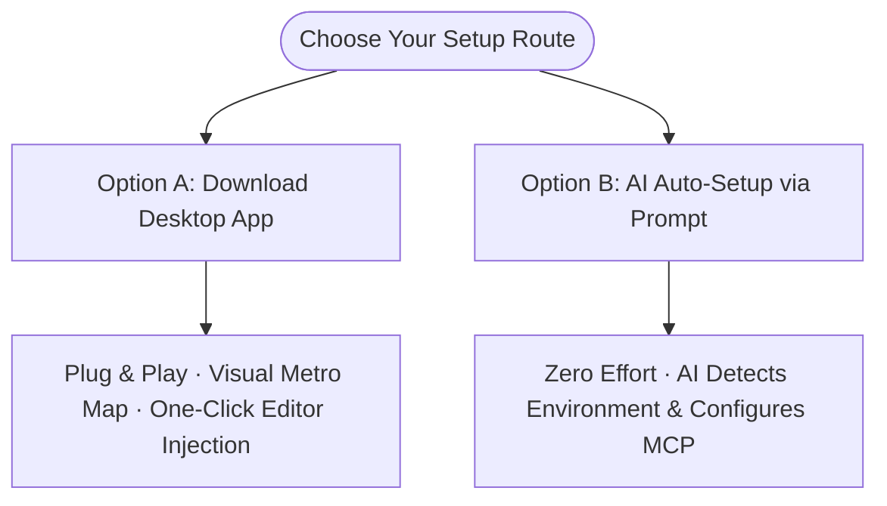

<div align="center">
  
  <h1>ContextOS — Context Operating System for AI Coding Agents</h1>
  <p><strong>A Deterministic Context Operating System via Model Context Protocol (MCP)</strong></p>
  <p>Mitigating context window saturation and attention drift in agentic software engineering through syntax-directed AST manipulation, out-of-band execution isolation, in-situ verification, and topological priority scheduling.</p>

  [](https://github.com/yubinbin32-ops/ContextOS/stargazers)
  [](https://www.npmjs.com/package/contextos)
  [](https://nodejs.org)
  [](LICENSE)
  [](https://modelcontextprotocol.io)

  <br/>

  <p><strong>Version: <span id="contextos-version">2.6.1</span></strong> · Five-host MCP and Skill adapters · Multi-turn Micro subagent</p>

  [**Download macOS App**](https://github.com/yubinbin32-ops/ContextOS/releases/latest) · [**Quick Setup Guide**](#start-in-30-seconds-ai-auto-setup) · [**中文文档**](README_zh.md)
</div>

---


---

## Background and System Motivation (Context Saturation & Attention Drift)

In complex software repositories, autonomous AI coding agents face a fundamental systems bottleneck: **rapid context window saturation and attention drift**. Under conventional agent workflows, assistants rely on indiscriminate whole-file dumping, raw build/test stdout feedback, and conversational trial-and-error. This introduces three systemic failures:

1. **Attention Budget Dilution & Hallucination**: Large volumes of raw build dumps and irrelevant source lines displace critical architectural invariants and type signatures in the prompt;
2. **Exponential Cost of Fault Investigation**: Truncated test outputs force the agent into recursive log-retrieval turns, compounding cumulative token consumption quadratically;
3. **Architectural Blindness & Session Amnesia**: Without a verifiable global symbol graph, clearing the context (`/clear`) or transferring tasks across subagents results in complete state degradation.

**ContextOS addresses this as a Context Operating System implemented over the Model Context Protocol (MCP)**:

| Subsystem | Architectural Mechanism | Evidence Boundary |
|---|---|---|
| **Syntax-Directed Access** | Tree-sitter multi-language AST engine extracting surgical symbol outlines and method slices | Bounded symbol slices instead of whole-file dumps |
| **Out-of-Band Execution** | Process execution and raw logs isolated outside the LLM context; returns signed receipts and diagnostic frames | Receipts plus diagnostic frames; raw logs stay out of context |
| **Metro Map Topology** | Materializes files, symbols, and dependencies into a strongly typed Block-Chain-Link graph | Deterministic structural navigation and impact context |
| **Persistent State Blackboard** | Compact incremental snapshot decoupling active state from chat history | Recovery receipt for cold starts and cross-session handoffs |

> Performance claims in this README are limited to the checked-in live-development validation below. Host tokens, peak context, provider tokens, and correctness are reported separately.

---

## What changes in daily development?

### 1. Architecture becomes a Metro Map

Blocks bind to real files, AST symbols, or directory trees (zero ghost blocks allowed). Dependency and resource directories use one bounded tree anchor instead of per-file bookkeeping; Chains represent horizontal subway rails, and typed Links connect transfer stations orthogonally.


### 2. Intent-Level 2-Turn Loop, Action Slots & In-Situ Diagnostics

- **Action Slots & Zero-Alignment Friction**: `explore` automatically provisions actionable target slots `[S1]`, `[S2]`. The AI doesn't need to guess line numbers or fiddle with verbatim target strings; it simply selects a slot and passes `change({ slot: "S1", append: "..." })` or replaces a symbol, completely eliminating parameter alignment failures.
- **In-Situ Verification & Instant Diagnostic Frames Extraction**:
  - The `change` step can embed the verification command directly (`verify: "npm test"`), atomically performing code patching, test execution, and receipt generation in a **single turn**.
  - **Eliminating Extra Log Rounds**: When a test fails in conventional workflows, truncated terminal output forces the AI to start 2–3 extra conversation turns just to inspect logs, wasting 20,000–40,000 tokens per incident. ContextOS features a built-in diagnostic extraction engine (`extractDiagnosticBlocks`) that parses TAP, Mocha, Jest, and SyntaxError frames directly, inlining test names, `+ actual - expected` assertion diffs, and exact `file:line:col` stacks into the `change` failure response. The AI sees the exact issue in the same turn with **0 extra log-fetching rounds**.
  - **Auto-Revert**: If tests fail, `autoRevert: true` instantly restores disk modifications in milliseconds, collapsing the traditional 6–9 round-trip debug cycle into an ultra-fast **2-turn loop** (`explore` ➔ `change` with in-situ `verify` ➔ `ship`).
- **Parallel Batching Over Serial Turns**:
  - Conventional AI tools encourage conversational, single-file serial editing that balloons context quadratically across turns.
  - ContextOS natively supports multi-concurrency: batch multi-file modifications in `edits: [...]` arrays and inspect multiple microservices in parallel via `inspect({ paths: [...] })`, cutting round-trip latency by over 60%.
- **Receipt-First Pipeline Output**:
  - `pipeline({ mode: "receipt" })` returns only bounded status, receipt, artifact, verdict, and exit references for successful batched actions. Use `mode: "summary"` or `mode: "full"` only when the action bodies are needed; batching should reduce host turns without re-expanding raw output.
- **Topological Retention Priority**:
  - Uses a priority-weighted context budgeting algorithm: `next` (0) → `slots` (1) → `where` (2) → `now` (3) → `slices` (4). In large repos, local code previews are clipped first, **guaranteeing that the system architecture map and action slots are never truncated**.
- **Lightweight Real-Time Blackboard & Instant Hydration (`.contextos/blackboard.md`)**:
  - The active session state is continuously persisted to a minimal **300-byte (~65 tokens)** blackboard. Developers or agents can `/clear` the chat at any time or hand off tasks across subagents; calling `explore` resumes full context in ~**150 tokens**, preventing multi-turn context inflation.


### 3. Commands run out-of-context

The command gateway behind `verify` and in-situ `change.verify` strips ANSI noise, redacts secrets, saves the full sanitized log into `.contextos/logs/`, and returns a compact receipt with critical diagnostics, reducing terminal noise by over 98%.

### 4. Code tools operate surgically with deep slicing (`inspect`)

Multi-language AST engines (compiler-grade parsing for JS/TS/JSX/TSX, Python, Swift, Java, Kotlin, C/C++, C#, Go, Rust, PHP, Ruby) allow VS Code-style symbol search, outline inspection, and surgical reading/editing with automatic symbol re-anchoring. The first-class `inspect` tool allows on-demand semantic slicing. When answering pure inquiry/comprehension queries ("where is X", "who calls Y"), the OS automatically omits unneeded edit slots and slices, cutting query context by another 50%.

### 5. Unified Knowledge & Architectural Decisions

Proposals, audits, architectural decisions, and rules live as OS Documents. `README.md` and `README_zh.md` appear read-only in the App Knowledge view with images and links intact.


### 6. Verification with Evidence

Every `verify` run produces a signed receipt. Checkpoints track pass/fail status per task, giving AI and humans a shared source of truth for what has actually been proven to work.


### 7. Long-running processes are monitored live

Dev servers, watchers, and background workers are managed by the Process Host and displayed in the Desktop App's bottom-left sidebar with live PID and port tracking.

## Supported Hosts

ContextOS supports five primary host families: Codex, Claude Code, OpenCode, Cursor, and Antigravity. Each integration uses the compact MCP surface plus the ContextOS Skill. The former lifecycle Hook layer has been removed so routing and recovery have one policy path instead of two competing implementations.

| Host | MCP and Skill | Status |
|---|---|---|
| Codex | Yes | Supported |
| Claude Code | Yes | MCP + Skill |
| OpenCode | Yes | MCP + Skill |
| Cursor | Yes | MCP + Skill |
| Antigravity | Yes | MCP + Skill |

The default MCP surface is the compact single `contextos` transport; the legacy multi-tool surface is opt-in with `CONTEXTOS_LEAN_SURFACE=0`. Repository reads, edits, and verification keep one evidence path through ContextOS MCP.

## Micro Task Subagent

Micro is an optional, multi-turn, controlled task subagent for bounded work such as log triage, contract distillation, and diagnostic summarization. Configure any OpenAI-compatible endpoint in `.contextos/profile.json` with `url`, `model`, `key`, and `sessionHeader`. OpenCode Go is the recommended subscription for users who want a low-friction hosted endpoint.

Micro keeps session state outside the main conversation, enforces turn and context limits, keeps tools disabled by default, and returns only the final result plus a receipt. Full reasoning and tool traces stay in the artifact store. Session actions are `create`, `send`, `get`, `list`, `close`, and `delete`.

Provider spend is bounded separately from host context. Each preset has a default provider-token ceiling; `maxProviderTokens`, `maxCostUsd`, `inputUsdPerMillion`, and `outputUsdPerMillion` can be set in the `micro` profile. Set `requireBulkInput: true` when a workflow must pass logs or artifacts through `inputRef`/`inputArtifact`/`inputReceipt` instead of inlining them. Sessions have a TTL, stale in-flight turns recover after a bounded interval, and cross-process writes use a lock file under `.contextos/micro-sessions/`.

When Micro needs repository evidence, attach it directly to the first call with `pipeline: { steps: [...] }` (the compatible `preload` form is also accepted). ContextOS runs that Pipeline once, briefly caches unchanged read-only evidence, keeps the raw result in an artifact, and injects only bounded evidence into Micro; direct evidence defaults to 2,400 characters and one provider request unless an explicit `invocation` budget opts into more. Do not call Pipeline separately and copy the same output into a second Micro call. Choose `delivery: "immediate"`, `"defer"`, `"errors-only"`, or `"auto"` to control whether the answer returns now, is recovered on the next top-level OS call, is hidden after a successful graph write, or is routed by Micro's `needsHost` decision; delivery changes host visibility, not provider cost.

Task `open` is read-only: it does not implicitly scan the working set, refresh AST locators, or append host-change notes. Request reconciliation explicitly with `task(action: "reconcile")` or `reconcile: true`, so cross-round recovery reads compact state instead of expanding durable context on every lookup.

Independent Micro tasks belong in one `action:"batch"` call; both their evidence preloads and provider requests are concurrency-bounded at four by default (hard maximum eight), while a shared-evidence task should use one attached Pipeline instead of duplicate reads.

Session and Micro-session state is scoped to the absolute workspace root. A copied checkout or worktree therefore starts with a clean session instead of inheriting another workspace's intent, receipts, touched files, or Micro history. Recorded host telemetry can be compared with `ops({ capability: "telemetry", action: "compare", args: { leftSessionId, rightSessionId } })`; its token values are estimates unless the host supplies actual usage.

Use `ops({ capability: "telemetry", action: "audit", args: { sessionId, baselineSessionId?, limit? } })` for a compact OS versus OS+Micro routing audit. It joins host calls/replay, Micro provider usage, delivery outcomes, and optional right-minus-baseline deltas without replaying raw logs. `savings.actualPercent` is populated only when both host and provider usage are complete actual receipts; character-derived host tokens and `replayChars / 4` remain proxies.

The repository also retains a 2026-09-26 historical development snapshot below. It is provenance, not a release gate: its arms used different turn counts and the run is not reproducible from the current checkout. Current acceptance requires the repeatable tests, bundle smoke, and real MCP acceptance described in the verification notes.

---

## Quick Start & Setup Options

ContextOS offers two straightforward onboarding routes for effortless setup:


```mermaid
graph TD
    User([Choose Your Setup Route]) --> ChoiceA[Option A: Download Desktop App]
    User --> ChoiceB[Option B: AI Auto-Setup via Prompt]
    
    ChoiceA --> FlowA[Plug & Play · Visual Metro Map · One-Click Editor Injection]
    ChoiceB --> FlowB[Zero Effort · AI Detects Environment & Configures MCP]
```

---

### Option A: Desktop App (macOS & Windows · Plug & Play · Recommended)

Download the package matching your environment from [GitHub Releases](https://github.com/yubinbin32-ops/ContextOS/releases/latest):

| Platform | Package | File | Size | Node.js Requirement | Best For |
|---|---|---|---|---|---|
| **Windows** | **NSIS Setup** *(Recommended)* | `ContextOS_<version>_x64-setup.exe` | ~8 MB | Requires Node.js 22+ | Windows 10/11 64-bit with desktop/start shortcuts. |
| **Windows** | **Portable Zip** | `ContextOS-windows-x64.zip` | ~10 MB | Requires Node.js 22+ | Zero-install, extract and run anywhere. |
| **Windows** | **Enterprise MSI** | `ContextOS_<version>_x64.msi` | ~8 MB | Requires Node.js 22+ | Managed enterprise/silent deployments. |
| **macOS** | **Full (Apple Silicon)** | `ContextOS-macos-full-arm64.zip` | ~35 MB | **None** (Bundles Node 22) | M1/M2/M3/M4 Macs; plug-and-play. |
| **macOS** | **Full (Intel)** | `ContextOS-macos-full-x64.zip` | ~38 MB | **None** (Bundles Node 22) | Intel Macs; plug-and-play. |
| **macOS** | **Standard Lite** | `ContextOS-macos-arm64.zip` / `x64.zip` | ~1.6 MB | Requires Node.js 22+ | Ultra-compact download if Node is already installed. |

#### Setup Steps:
1. **Windows**: Run the installer `.exe` or extract the portable `.zip` and launch **ContextOS**.
   **macOS**: Unzip the downloaded archive and drag **ContextOS.app** into `/Applications`.
2. Launch **ContextOS**, open **Settings** (gear icon), select your detected AI editor (Cursor / Claude Desktop / Antigravity / OpenCode / Codex), and click **Install / Sync Plugin**.

> [!IMPORTANT]
> Run **ContextOS.app** from `/Applications`, not directly from `Downloads`, a mounted DMG, or another read-only volume. Plugin synchronization writes user-level files to `~/.contextos` and `~/plugins`; the app bundle itself is treated as an immutable source.

3. The App injects the ContextOS MCP configuration and unique Skills directly into your editors. **Once configured, you can close the desktop App; it does NOT need to stay running.**
4. In your AI coding chat, simply activate ContextOS:
   > *"Write this proposal into ContextOS and start execution"* or *"Inspect ContextOS and resume development"*

> [!IMPORTANT]
> **First-time launch on macOS shows "Cannot be opened" or "Unidentified Developer"?**
> ContextOS is an open-source tool without Apple's paid developer certificate notarization. macOS Gatekeeper will block it on first launch by default. You only need to allow it once:
> - **Method 1 (System Settings · Recommended)**: Open macOS **System Settings ➔ Privacy & Security**, scroll down to the "Security" section, and click **Open Anyway** next to "ContextOS was blocked". Enter your password to confirm.
> - **Method 2 (Control-Click Shortcut)**: In Finder, open `/Applications`, hold **Control and click (or right-click)** `ContextOS.app`, select **Open** from the context menu, and click **Open** in the confirmation dialog.


---

### Option B: AI Auto-Setup via Prompt (Zero Effort) {#start-in-30-seconds-ai-auto-setup}

If you are already in an AI coding assistant (Codex / Claude Code / OpenCode / Cursor / Antigravity), let the AI configure everything automatically. Other hosts are supported through an AI-written adaptation layer:

> **Copy and paste this instruction into your AI coding assistant:**  
> **"Please read `https://github.com/yubinbin32-ops/ContextOS/blob/main/AI_SETUP.md`, detect my system environment, and configure ContextOS for me."**

#### What the AI does in the background:
1. **System & Client Inspection**: If on macOS, asks if you want the native Desktop App (`ContextOS.app`) and deploys it automatically.
2. **Runtime Verification**: Checks for Node.js 22+ (or uses the runtime bundled with ContextOS.app).
3. **Targeted Precision Injection**: Asks which editors you use (Cursor / Codex / Claude Desktop, etc.) and injects only the selected platforms, eliminating duplicate skill noise.
4. **Demand-Driven Collaboration Mode**: Asks if you need solo local development or team collaboration, configuring local SQLite or Cloudflare D1 accordingly.
5. **Project Initialization**: Initializes the current project and verifies tools.


---

## Storage Modes: Local & Experimental Cloud Collaboration

ContextOS treats the **local workspace project directory** as the absolute source of truth (code reads, AST edits, test runs, and logs always run locally):

- **Local Storage Mode**: Designed for solo development. Architecture data is stored in the project's `.contextos/state.sqlite`. 100% offline, private, and zero network latency.
- **Experimental Cloud Collaboration Mode**: Designed for evaluating team collaboration. Connects to a serverless Cloud Hub (Cloudflare D1 edge database) to synchronize architectural topology and progress across teammates and devices. Treat this mode as experimental until its API and operational model stabilize.
  - **Multi-Project Strict Isolation**: Cloud Hub partitions entities by `projectId`. A single Cloudflare Worker backs multiple independent repositories cleanly.
- **Lossless Two-Way Switching**: Switch storage modes anytime by prompting your AI:
  - *"Switch current project to cloud collaboration mode"* ➔ Local SQLite graph is pushed to Cloud D1.
  - *"Switch current project back to offline local mode"* ➔ Cloud snapshot is synced back to local SQLite for offline development.

---

## Development Validation Notes

Validation uses real sub-agent conversations, not benchmarks, leaderboards, or synthetic scores. The purpose is to observe a complex feature through discovery, a failing test, diagnosis, repair, verification, and closure.

### Manual A/B/C protocol

All arms use the same job-system fixture, tests, acceptance oracle, and isolated roots. The task is fixed to five rounds:

1. Discover the structure and target symbols without editing.
2. Preserve two intentional implementation defects, run the tests, and save bounded receipt/artifact evidence.
3. Diagnose the failure: A reads the failure directly, B reuses the receipt, and C attaches one bounded Pipeline directly to Micro when evidence is heavy.
4. Apply the repair and verify it; B/C use one atomic change/work route.
5. Run the acceptance oracle and close with an explicit semantic Block/Chain payload in ship. ModuleIndex navigation hints never count as ownership.

| Arm | Responsibility | Main route | Micro |
|---|---|---|---:|
| A | Normal development control | shell, edit, test | 0 |
| B | ContextOS | explore/inspect, one Pipeline, change/work, ship | 0 |
| C | ContextOS + Micro | B's route; one bounded Pipeline attached to Micro | Only when evidence is heavy and the host needs it, normally once |

Micro has an explicit lifecycle: a pipeline can be supplied at creation so the host does not run the same discovery once and Micro again; deferred results are stored in OS and recovered on the next call; errors-only returns only failures; unnecessary answers stay out of the host conversation. Evidence tasks default to one provider request, and empty answers do not trigger unbounded retries.

### Current reproducible result

The latest real five-round sub-agent run completed implementation, tests, and acceptance for A/B/C. A used normal shell, B used ContextOS, and C used one direct Pipeline→Micro route. The run exposed two real defects: an unsynchronized installed bundle silently dropped ship.architecture, and an older Micro route reported a forbidden second request as a budget error after an empty answer. The install path now synchronizes the repository bundle, plugin cache, and ~/.contextos; the empty-answer path now reports the empty result and explicitly skips a retry once the request budget is reached. Any already-running MCP process still requires a new session before it can be evidence for the new build.

Host-visible actions and OS-internal telemetry are counted separately; internal Pipeline fan-out is not presented as extra host conversation. The observed five-round run was:

| Arm | Rounds | External calls | Internal calls | Provider | Result |
|---|---:|---:|---:|---:|---|
| A | 5 | 12 shell + 2 edits | n/a | 0 | Tests and acceptance passed |
| B | 5 | 10 | 11 | 0 | Repair, tests, and acceptance passed |
| C | 5 | 9 | 9 | Two attempts in an older session; 1,695 provider tokens | Repair, tests, and acceptance passed; old-session architecture failure was isolated |

The local MCP proxy does not expose the host model's input/cached/output/reasoning tokens, so character-derived proxy values are never presented as billing savings. Micro prompt/completion/total usage is recorded separately in .contextos/logs/micro-usage.jsonl. A savings comparison is valid only when the arms use the same rounds, acceptance, implementation hash, and MCP build; the old-session contamination means this run does not claim a universal 50–80% or 80% saving.

### Graph hygiene and ownership

The repository graph is now curated through ContextOS ops as 31 semantic Blocks, 12 Chains, and 32 Links, with Chinese titles/summaries. Validation reports a valid Chain layout, zero duplicate artifact locators, zero deleted paths, zero mod-* or kind=module Blocks, zero orphan Blocks, and no dangling members or links.

A Block is a stable semantic responsibility; a Chain is a meaningful business or runtime flow; a Link is a cross-responsibility relationship. ModuleIndex is navigation only. Rebinding uses replacePaths=true as a complete ownership refresh, preventing stale scripts, moved files, and duplicate symbol locators from surviving. The verification Block binds only current runnable acceptance/smoke/fixture scripts; deleted benchmark scripts are not mounted.

### Local acceptance commands

npm test

npm run plugin:verify

npm run dist:smoke

npm run acceptance:real

npm run acceptance:micro

These are regression and distribution checks, not synthetic benchmark gates. Run npm run desktop:build when a release requires a full desktop build.

### Known limits

- The manual run covers one complex feature domain and one provider; its consumption figures diagnose workflow, not billing.
- A/B/C must use fresh MCP sessions. Updating a file cannot restart an already-loaded server.
- Micro is conditional: it helps when evidence is large enough to repay provider input and the host genuinely needs the diagnosis; small tasks should skip it.
- SQLite, receipts, artifacts, telemetry, and sessions under .contextos are runtime recovery state, not extra source files; do not commit local runtime state.

---

## Architecture Evolution

ContextOS has deliberately changed direction as real usage exposed new costs:

- **0.4.x:** regex parsing, Ghost Blocks, and a 49-tool MCP surface made architectural memory unreliable.
- **V2:** introduced real-code Blocks, AST-backed visibility, SQLite plus `graph.json`, and formal development governance.
- **Intent-level architecture:** the default public surface is one `contextos` transport routed by `action` (`explore` / `inspect` / `work` / `change` / `verify` / `ship` / `pipeline` / `ops`); named tools remain only as an opt-in compatibility surface, while orchestration stays in the OS and module metadata derives from the codebase.
- **2.5.0:** hardens project identity, release/update paths, graph synchronization, atomic edits, and lifecycle gates.

[Read the full decision history →](DECISION.md)

---

## For Contributors

```bash
git clone https://github.com/yubinbin32-ops/ContextOS.git
cd ContextOS
npm ci
npm test
npm run plugin:verify
npm run verify             # full release gate
npm run desktop:build      # macOS + Swift/Xcode
```

The versioned `.contextos/graph.json` is the project's portable graph projection.

[Contributing](CONTRIBUTING.md) · [Security](SECURITY.md) · [MIT License](LICENSE)
