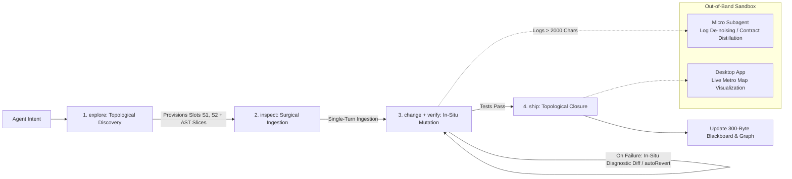
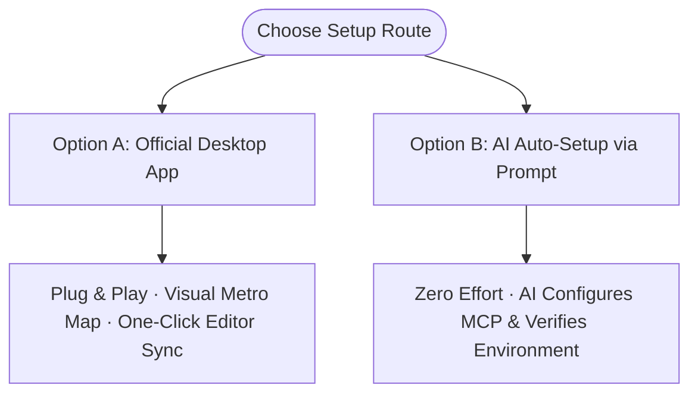

<div align="center">
  
  <h1>ContextOS — Context Operating System for AI Coding Agents</h1>
  <p><strong>A Deterministic Context Operating System & MCP Execution Layer for AI Coding Agents</strong></p>
  <p>Mitigating context window saturation and attention drift in LLM-driven engineering through syntax-directed AST slicing, out-of-band execution isolation, in-situ test diagnostics, topological metro maps, and out-of-band Micro dual-brain subagents.</p>

  [](https://github.com/yubinbin32-ops/ContextOS/stargazers)
  [](https://www.npmjs.com/package/contextos)
  [](https://nodejs.org)
  [](LICENSE)
  [](https://modelcontextprotocol.io)

  <br/>

  <p><strong>Current Version: <span id="contextos-version">2.6.1</span></strong> · Native multi-host integration · Official macOS & Windows Desktop Apps · Micro Dual-Brain</p>

  [**Download Desktop App**](https://github.com/yubinbin32-ops/ContextOS/releases/latest) · [**Quick Setup Guide**](#quick-start--setup-options) · [**AI Auto-Setup Specification**](AI_SETUP.md) · [**中文文档**](README_zh.md)
</div>

---


---

## 1. What is ContextOS?

**ContextOS** is not a collection of ad-hoc helper scripts—it is an **operating system for LLM context windows (Context Operating System)** embedded into the AI coding agent's execution lifecycle.

In conventional AI programming, an LLM acts like a "bare-metal program without an OS", interacting directly with terminals and dumping raw files into prompt history. This inevitably leads to **context explosions, catastrophic attention drift, and session amnesia**.

ContextOS bridges the AI agent and the codebase via the **Model Context Protocol (MCP)**, providing a deterministic system orchestration layer:
- **Materializes the codebase into a Metro Map**: Strongly typed Block-Chain-Link architecture;
- **Transforms raw file reads into surgical AST slices**: Extracts only targeted method bodies and interface outlines;
- **Isolates terminal execution out-of-band**: Build logs and test traces run in a private sandbox;
- **Delivers in-situ failure diagnostics**: Embeds test execution and assertion diff parsing directly into code mutation steps;
- **Deploys a Micro Dual-Brain Subagent**: Triages tens of thousands of characters of verbose compiler traces out-of-band, keeping the host conversation focused.

---

## 2. What Problems Does It Solve?

| Core Problem | Conventional Native Agent Workflow | ContextOS Solution |
|:---|:---|:---|
| **① Context Window Saturation & Attention Drift** | Modifying 5 lines triggers dumping 1,000 lines of source code via `cat`. After a few turns, prompt history is flooded with irrelevant tokens, causing hallucinations and forgotten invariants. | **Syntax-Directed AST Slicing**: Slices only targeted method symbols and interfaces, reducing context by 70%~90%. Guaranteed topological priority ensures architectural maps are never dropped. |
| **② The Test-Failure "Log Trap" & Token Bleed** | When a test fails, truncated terminal output forces the agent to spend 2–3 extra turns guessing and reading logs with shell commands, burning 20,000~40,000 tokens per failure. | **Atomic Mutation + In-Situ Diagnostics**: The `change` step embeds `verify: "npm test"`. Built-in parsers (TAP/Jest/SyntaxError) extract failure diffs and stack traces in the same turn—**0 extra log-fetching turns**. |
| **③ Trial-and-Error Alignment Friction** | Agents struggle to locate exact lines, repeatedly using `grep` or failing string substitutions due to minor whitespace or indentation mismatches. | **Action Slots `[S1]`, `[S2]`**: `explore` provisions deterministic target slots. The AI fills code by slot selection, eliminating parameter alignment errors. |
| **④ Architectural Blindness & Session Amnesia** | After `/clear` or delegating tasks across subagents, the agent loses all context and must re-crawl the repository from scratch. | **300-Byte Persistent Blackboard**: Live state continuously syncs to `.contextos/blackboard.md`. Calling `explore` rehydrates full architectural context in **~150 tokens**. |

---

## 3. How We Do It (Core Architecture & Mechanisms)


```mermaid
graph LR
    User[Agent Intent] --> Explore[1. explore: Topological Discovery]
    Explore -->|Provisions Slots S1, S2 + AST Slices| Inspect[2. inspect: Surgical Ingestion]
    Inspect -->|Single-Turn Ingestion| Change[3. change + verify: In-Situ Mutation]
    Change -->|On Failure: In-Situ Diagnostic Diff / autoRevert| Change
    Change -->|Tests Pass| Ship[4. ship: Topological Closure]
    Ship --> Blackboard[Update 300-Byte Blackboard & Graph]
    
    subgraph Out-of-Band Sandbox
        Micro[Micro Subagent<br>Log De-noising / Contract Distillation]
        Desktop[Desktop App<br>Live Metro Map Visualization]
    end
    Change -.->|Logs > 2000 Chars| Micro
    Ship -.-> Desktop
```

### 1. Architecture as a Metro Map
Blocks represent stable semantic files or AST symbols, Chains represent horizontal business subway lines, and typed Links represent cross-subsystem transfer stations. The official desktop app (macOS & Windows) provides live interactive subway maps.


### 2. Action Slots & In-Situ Diagnostics
- **Action Slots**: `explore` analyzes intent and outputs actionable slots `[S1]`, `[S2]`. The AI selects a slot and passes `change({ slot: "S1", append: "..." })` with zero parameter alignment friction.
- **In-Situ Verify**: `change` can embed `verify: "npm test"`. If tests fail, `extractDiagnosticBlocks` automatically parses assertion diffs (`+ actual - expected`) and `file:line:col` stack frames directly into the response. If needed, `autoRevert: true` rolls back disk modifications in milliseconds.

### 3. Out-of-Band Execution & Log Sanitization
Commands execute through an isolated gateway that strips ANSI noise and redacts secrets. Full logs are stored in `.contextos/logs/`, returning compact signed receipts to the LLM, reducing terminal context noise by >98%.

### 4. 300-Byte Persistent Blackboard
Session state is continuously persisted to a minimal ~300-byte (~65 tokens) blackboard (`.contextos/blackboard.md`). After `/clear`, calling `explore` resumes complete context in **~150 tokens**.

### 5. Micro Dual-Brain Subagent
Heavy compiler traces, massive test outputs, and contract distillation are delegated out-of-band to Micro. Compatible with any OpenAI-format endpoint (OpenCode Go, DeepSeek, or local Ollama), Micro digests bulk text in a background sandbox and returns a concise summary receipt.

---

## 4. Performance & Tool-by-Tool ROI (Real-World Benchmark)

### Tool-by-Tool Improvement Breakdown

| Tool / Mechanism | Operational Difference vs Native Agent | Context & Efficiency Impact |
|:---|:---|:---|
| **`explore`** | Replaces 3–5 serial rounds of blind `ls`/`find`/`grep` with one structured pass provisioning slots `[S1]`, `[S2]`. | **Cuts discovery turns by 50%**, eliminating parameter alignment friction. |
| **`inspect`** | Replaces whole-file `cat` (1,000–3,000 lines) with surgical method AST slices. | **Saves 70% ~ 90% context per read**. |
| **`change + verify`** | Replaces separate edit-then-test loops with atomic mutation and in-situ assertion diff extraction. | **Eliminates 2–3 log-fetching turns; saves 20,000 ~ 40,000 tokens per failure**. |
| **`ship + blackboard`** | Replaces multi-thousand-token prompt replay after `/clear` with a 300-byte blackboard. | **Cold start takes ~150 tokens (>98% context savings)**. |
| **`micro` (Dual-Brain)** | Replaces dumping 50,000-character test traces into prompt history with out-of-band distillation. | **Zero host context pollution; 3x improvement in long-horizon task stability**. |

---

### Objective ROI Boundary & Task Complexity Analysis (A/B Test Reality)

Different task complexities yield drastically different returns on context operating systems. We present real-world data transparently:

```text
[Task Complexity vs ContextOS Token ROI]

Token
Savings %
  ▲
70%│                                     ● Complex Long-Horizon Tasks (50%~75% Savings)
  │                              ● 
  │                      ● Medium Multi-File Tasks (20%~40% Savings)
 0%├─────────────────────┬───────────────────────────────► Task Complexity
   │ Trivial Edits (Negative ROI) ●
-80%│
```

1. **⚠️ Trivial Tasks (Single-file tweak, 1-line bugfix, short Q&A)**:
   - **Empirical Return: NEGATIVE ROI (-50% ~ -200%)**!
   - **Root Cause**: Maintaining the Metro map, slot calculations, and blackboard synchronization incurs ~2,000–4,000 tokens of fixed protocol metadata. For a 1-line edit (which takes ~500 tokens with native tools), running the full OS ceremony is counterproductive.
   - **Best Practice**: **For simple 1-line edits, use native editing tools or a single direct `change` without full `explore`/`ship` ceremonies!**
2. **✅ Medium Tasks (3–6 turns, 2–4 files, accompanied by unit tests)**:
   - **Empirical Return: MODERATE POSITIVE ROI (20% ~ 40% token savings)**. In-situ verification and parallel AST batching eliminate waiting roundtrips.
3. **🚀 Complex Long-Horizon Tasks (10+ turns, deep test debugging, large refactor, multi-day handoffs)**:
   - **Empirical Return: MASSIVE POSITIVE ROI (50% ~ 75% total token savings, >50% turn reduction)**. Completely eliminates log explosions and session amnesia.

### Running Your Own A/B Test
Use the built-in telemetry audit capability to compare real token consumption between sessions:
```javascript
contextos({
  action: "ops",
  args: {
    capability: "telemetry",
    action: "audit",
    args: { sessionId: "current-session", baselineSessionId: "baseline-session" }
  },
  projectRoot: process.cwd()
})
```

---

## 5. Quick Start & Setup Options

ContextOS provides two straightforward onboarding routes:


```mermaid
graph TD
    User([Choose Setup Route]) --> ChoiceA[Option A: Official Desktop App]
    User --> ChoiceB[Option B: AI Auto-Setup via Prompt]
    
    ChoiceA --> FlowA[Plug & Play · Visual Metro Map · One-Click Editor Sync]
    ChoiceB --> FlowB[Zero Effort · AI Configures MCP & Verifies Environment]
```

### Option A: Desktop App (macOS & Windows · Plug & Play · Recommended)

Download the package matching your environment from [GitHub Releases](https://github.com/yubinbin32-ops/ContextOS/releases/latest):

| Platform | Package | Size | Node.js Requirement | Best For |
|:---|:---|:---|:---|:---|
| **macOS** | `ContextOS-macos-full-arm64.zip` | ~35 MB | **Zero dependency** (Bundles Node 22) | Apple Silicon (M1/M2/M3/M4) Macs; recommended |
| **macOS** | `ContextOS-macos-full-x64.zip` | ~38 MB | **Zero dependency** (Bundles Node 22) | Intel Macs; recommended |
| **macOS** | `ContextOS-macos-arm64.zip` / `x64.zip` | ~1.6 MB | Requires Node.js 22+ | Ultra-compact download if Node 22 is installed |
| **Windows** | `ContextOS_<version>_x64-setup.exe` | ~8 MB | Requires Node.js 22+ | Recommended installer with desktop & start menu shortcuts |
| **Windows** | `ContextOS-windows-x64.zip` | ~10 MB | Requires Node.js 22+ | Portable zero-install edition |

#### Setup Steps:
1. **Launch ContextOS**:
   - macOS: Unzip archive and drag `ContextOS.app` into `/Applications`.
   - Windows: Run the installer `.exe` or extract the portable `.zip`.
2. **One-Click Sync**:
   - Open ContextOS, click **Settings** (gear icon), select your AI editor (Cursor / Codex / Claude Desktop / Antigravity / OpenCode), and click **Install / Sync Plugin**.
3. **Done**:
   - Once configured, you can close the Desktop App; it does not need to stay running in the background.
4. **macOS Gatekeeper Warning ("Unidentified Developer" or "Cannot be opened")?**
   - As an open-source tool without paid Apple notarization, Gatekeeper blocks first launch by default. Allow it once:
     - **Method 1 (Recommended)**: Open **System Settings ➔ Privacy & Security**, scroll down to Security, and click **Open Anyway** next to "ContextOS.app was blocked".
     - **Method 2 (Control-Click)**: In Finder, open `/Applications`, hold **Control and click (or right-click)** `ContextOS.app`, and select **Open**.


---

### Option B: AI Auto-Setup via Prompt (Zero Effort)

If you are already in an AI coding assistant (Codex / Claude Code / Cursor / Antigravity / OpenCode):

> **Copy and paste this instruction into your AI coding assistant:**  
> **"Please read `AI_SETUP.md`, detect my system environment, and configure ContextOS for me."**

The AI will follow [AI_SETUP.md](AI_SETUP.md) automatically:
1. Recommends Desktop App or MCP injection based on OS;
2. Injects MCP configuration and unique Skills without duplicate clutter;
3. Recommends local storage mode for rock-solid stability;
4. Inquires about Micro dual-brain setup;
5. Runs `doctor` verification and outputs a readiness card.

---

## 6. Storage Modes & Recommendations

ContextOS treats the **local workspace project directory** as the absolute source of truth:
- **Local Storage Mode (Strongly Recommended ⭐⭐⭐⭐⭐)**:
  - Architecture data resides in `.contextos/state.sqlite`;
  - 100% offline, zero network latency, complete privacy;
  - **The standard choice for all solo development.**
- **Experimental Cloud Collaboration Mode (Public Beta ⚠️)**:
  - Synchronizes the graph across teammates and devices using Cloudflare D1 edge database;
  - **Current status**: Under active development and testing. Recommend local mode unless team real-time sync is strictly necessary.
- **Lossless Two-Way Switching**:
  - Say to your AI: *"Switch current project to cloud collaboration"* ➔ Local SQLite graph is pushed to Cloud D1;
  - Say to your AI: *"Switch current project back to offline local mode"* ➔ Cloud snapshot is synced back to local SQLite.

---

## 7. Recent Changelog

### v2.6.x (Latest Release)
- **Lean MCP Surface**: Unified the primary interface into a single compact `contextos` MCP transport, reducing prompt definition token footprint;
- **In-Situ Test Failure Diagnostics**: Embedded `extractDiagnosticBlocks` into `change`, extracting TAP/Jest assertion diffs and stack frames directly into failure responses;
- **Official Windows Native Desktop App**: Released official Windows 10/11 installers and portable packages with 1:1 Metro map parity;
- **Micro Dual-Brain Subagent**: Added OpenAI-compatible background subagent integration (OpenCode Go / DeepSeek / Ollama) with concurrent pipeline preloading and out-of-band log de-noising;
- **Doctor Diagnostic Engine**: Added system `doctor` command to inspect Node runtime, storage mode, editor configurations, and Cloud connectivity;
- **Lossless Storage Migration**: Added atomic two-way switching between local SQLite and cloud Cloudflare D1.

---

## 8. For Contributors

```bash
git clone https://github.com/yubinbin32-ops/ContextOS.git
cd ContextOS
npm ci
npm test
npm run plugin:verify      # plugin specification and smoke test
npm run dist:smoke         # distribution layout validation
npm run desktop:build      # build desktop app (macOS)
```

[Contributing](CONTRIBUTING.md) · [Security](SECURITY.md) · [MIT License](LICENSE)
