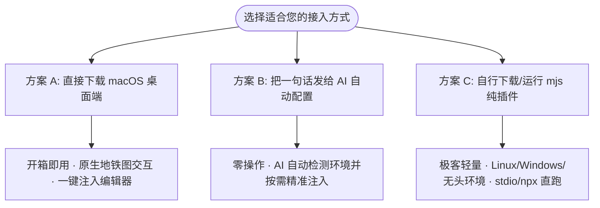

<div align="center">
  
  <h1>AI 编码的高精度外骨骼动力装甲</h1>
  <p><strong>通过 MCP 自动管理上下文，实测减少 90%+ 上下文开销。</strong></p>
  <p>解决大项目上下文挤爆与记忆遗忘：以手术刀级 AST 读写代替盲读长文件，以脱敏日志出舱隔绝终端噪声，以地铁图谱让 AI 秒懂架构。</p>
  <p><a href="https://github.com/yubinbin32-ops/ContextOS/releases/latest"><strong>下载 macOS App</strong></a> · <a href="#30-秒极速配置ai-自动安装引导">30 秒极速开启</a> · <a href="README.md">English</a></p>
</div>


## ContextOS 解决什么问题？

**ContextOS 就像为 AI 编码助手穿上一套高精度外骨骼动力装甲**：
以往让 AI 参与大型项目开发，AI 必须肉身背负海量源文件、全量终端日志和冗长规范，导致“走两步就喘”——上下文窗口迅速挤爆、产生幻觉并遗忘前置决议。

有了 ContextOS，AI 不再需要背负笨重的全量上下文行走，而是**通过 MCP 自动管理上下文**：
1. **外骨骼精准借力**：通过编译器级 AST 手术刀工具，按需读写关键符号与代码块，杜绝盲读长文件；
2. **终端噪声舱外隔绝**：运行日志安全存盘并脱敏，仅向上下文回传精简诊断回执，剥离 98% 无关噪声；
3. **全局神经图谱联通**：以地铁图谱（Metro Map）统合沉淀架构记忆与派生模块图谱，开箱即懂系统全貌。

**实测在复杂项目开发中，能够直接减少 90%+ 的无谓上下文开销**，彻底告别上下文挤爆与遗忘，让每一次对话都能平滑承接工程进展。


## 它带来的核心开发变化

### 1. 架构化身地铁路线图 (Metro Map)
Block 绑定真实文件、AST 符号或目录树（杜绝虚空 Ghost Block）。依赖与资源目录使用单个有界 tree 锚点，不再逐文件记账；Chain 代表水平平行的地铁铁轨，带类型的 Link 形成正交的跨线换乘。AI 一眼看清系统骨架，无需盲读代码。


### 2. AI 只表达意图，OS 自行跑完闭环
AI 只需调用 `explore` → `change` → `verify` → `ship`：OS 从 git 派生工作集、用 AST 派生模块自动归属文件、自动挂接验证回执，并把每次返回压进上下文预算。覆盖率与证据门禁默认为 advisory，`.contextos/profile.json` 设 `strict: true` 可恢复硬门禁。

### 3. 命令运行出舱脱敏 (Out-of-Context Execution)
`verify` 与 `ops` 背后的命令网关会剥离 ANSI 终端控制符与敏感密钥，全量**脱敏后**日志存盘于 `.contextos/logs/`，仅向上下文返回精简回执（Receipt），削减 98% 以上的终端输出噪声。

### 4. 代码工具手术刀级读写 (Surgical Code Engineering)
集成编译器级真 AST 引擎（原生支持 JS/TS/JSX/TSX、Python、Swift、Java、Kotlin、C/C++、C#、Go、Rust、PHP、Ruby 等 10+ 种主流语言），支持 VS Code 风格全局符号搜索、大纲审视、方法级抽取和补丁式精准写盘并自动重锚。

### 5. 单一入口的知识与架构决议
项目方案、设计取舍与规则规约归纳为单文件叙事 `DECISION.md` 与分类 Rules。`README.md` 与 `README_zh.md` 在 App 的知识抽屉中以只读方式直接预览。


### 6. 长期运行进程常驻监控
通过守护进程托管 Dev Server、Watcher 与后台 Worker，在桌面端左下角实时监控 PID、端口号与生命周期，支持一键安全释放进程树。


## 快速上手与安装方式

ContextOS 提供了三种灵活的安装与接入方式，满足从小白到硬核极客的所有场景：



---

### 方案 A：直接下载 macOS 桌面端（开箱即用 · 强烈推荐）

从 [GitHub Releases 最新发布页](https://github.com/yubinbin32-ops/ContextOS/releases/latest) 下载对应安装包：

| 安装包版本 | 压缩包文件 | 体积 | Node.js 依赖 | 适用场景 |
|---|---|---|---|---|
| **完整版 (Full)** *(首选推荐)* | `ContextOS-macos-full.zip` | 约 35 MB | **零依赖**（内置独立 Node 22） | 电脑未装 Node 或追求纯傻瓜式开箱即用 |
| **轻量原版 (Standard)** | `ContextOS-macos.zip` | 约 1.6 MB | 需系统已有 Node.js 22+ | 本地已有 Homebrew/nvm Node 环境的开发者 |

#### 极速配置流程：
1. 解压下载的压缩包，将 **ContextOS.app** 拖入 `Applications`（应用程序）目录。
2. 打开 **ContextOS**，进入 **设置**（齿轮图标或快捷键 `Cmd+,`），勾选需要配置的 AI 编辑器（Cursor / Claude Desktop / Antigravity / OpenCode / Codex 等），点击 **一键安装 / 同步插件**。
3. App 会自动将 MCP 配置及对应运行路径注入编辑器。**配置完成后，你可以随时关闭桌面 App，平时无需保持开启**。
4. 在编辑器对话中只需一句话唤醒 ContextOS 协作：
   > **“把这个方案写入 ContextOS 后开始执行”** 或 **“查看 ContextOS 继续开发”**

> [!IMPORTANT]
> **首次在 macOS 打开提示“无法打开”或“已拦截未受信任的开发者”？**
> 由于独立开源软件尚未加入苹果付费开发者签名公证，macOS Gatekeeper 安全机制会在首次双击启动时弹出风险拦截提示。这是 macOS 的正常保护机制，**仅需在首次启动时放行一次即可**：
> - **方式一（系统设置放行 · 推荐）**：打开 macOS **“系统设置” (System Settings) ➔ “隐私与安全性” (Privacy & Security)**，向下滑动到“安全性”栏目，在“已拦截 ContextOS.app”旁边点击 **“仍要打开” (Open Anyway)** 并确认。
> - **方式二（快捷右键打开）**：在“访达”（Finder）的“应用程序”中找到 `ContextOS`，按住 **Control 键点按（或右键）** 应用图标，在右键菜单中点击 **“打开”**，并在二次弹出的警告窗中点击 **“打开”**。


---

### 方案 B：把一句话发给 AI，全流程自动配置（零操作）

适合已经打开 AI 编程助手（Cursor / Codex / Claude Code / Windsurf / Antigravity）的开发者。用户无需敲打命令行，只需做选择，由 AI 在后台自举完成全部配置：

> **只需复制下方指令，发送给您的 AI 编程助手对话框：**  
> **“请阅读 `https://github.com/yubinbin32-ops/ContextOS/blob/main/AI_SETUP.md`，检测我的系统环境，为我自动安装并配置好 ContextOS。”**

#### AI 将在后台为您自动完成：
1. **系统与桌面端探测**：若检测为 macOS，AI 会主动询问是否需要下载原生的可视化桌面端（ContextOS.app），确认后全自动下载部署。
2. **Node 运行时自检**：自动验证 Node.js 22+ 环境（或使用桌面端自带的内嵌 Node）。
3. **按需精准注入**：向用户确认需要配置哪些编辑器（如 Cursor / Codex / Claude 等），精准注入对应 MCP 配置与唯一 Skill，**杜绝重复 Skill 冗余**。
4. **协作模式按需确认**：询问用户是需要单人本地开发还是团队协同开发，并自动完成对应配置与初始化。
5. **当前项目初始化与工具验证**：根据用户选择初始化本地离线模式或云端模式，并完成轻量自检。

---

### 方案 C：自行下载/运行 `contextos-mcp.mjs` 纯插件流（无桌面端 · 极客首选）

> [!NOTE]
> 适合不想安装桌面 App、在 Linux / Windows 纯命令行、远程服务器、容器环境或纯 CLI 模式下开发的开发者。
> **前提环境要求**：系统已安装 Node.js >= 22。

#### 1. 纯命令行直接通过 npx 启动
```bash
npx -y github:yubinbin32-ops/ContextOS
```

#### 2. 自行下载编译好的独立单文件插件
直接从 Release 或代码仓库获取编译就绪的单文件包：[`plugins/contextos/server/contextos-mcp.mjs`](plugins/contextos/server/contextos-mcp.mjs)。

在你的编辑器配置（如 Cursor `mcp.json` 或 Claude Desktop 配置）中添加本地 stdio 命令：
```json
{
  "mcpServers": {
    "contextos": {
      "command": "node",
      "args": ["/绝对路径/plugins/contextos/server/contextos-mcp.mjs"]
    }
  }
}
```

---

## 存储模式说明：本地与实验性云端协同

ContextOS 始终以**本地工作区项目目录**为核心基石（代码阅读、AST 手术刀修改、脱敏命令执行均在本地完成）：

- **本地存储模式**：适合单人本地开发。数据保存在项目根目录的 `.contextos/state.sqlite`，0 毫秒响应延迟，100% 离线，完全保护代码与架构隐私。
- **实验性云端协同模式**：用于评估团队协作。通过项目配置将架构图谱托管在 Serverless 云端中枢（Cloudflare D1），多名团队成员协同开发时同步模块契约。API 与运维模型稳定前，请将云端模式视为实验能力。
  - **天然支持多项目严格隔离**：云端中枢基于严格的 `projectId` 分区存储，同一套云端 Worker 和 D1 数据库可同时支持您开发无数个不同项目，彼此独立互不串扰。
- **随时双向无损切换**：开发过程中，您只需对 AI 说：
  - *“把当前项目切换为云端协同模式”* ➔ 本地数据自动完整推送到云端 D1；
  - *“把当前项目切回本地离线模式”* ➔ 云端最新架构快照自动下载至本地 SQLite，后续开发完全离线。

## 架构演进历史

ContextOS 会随着真实使用反馈主动修正架构方向：

- **0.4.x**：正则解析、Ghost Block 与 49 个工具的 MCP 面让架构记忆不可靠。
- **V2**：引入真实代码 Block、AST 可见性、SQLite + `graph.json` 双物化和正式开发治理。
- **意图级架构**：公开入口收敛为 `explore` / `change` / `verify` / `ship` / `ops`，编排下沉到 OS，模块信息从代码库自动派生。
- **2.5.0**：加固项目身份、发布升级链路、图谱同步、原子编辑和生命周期门禁。

完整取舍与历史弯路见 [DECISION.md](DECISION.md)。

## 实测 ContextOS 上下文节省基准

基准数据由当前代码库动态生成，不再硬编码历史版本的文件、Block、Chain、Link 数量。请在本地运行以下脚本获取当前 checkout 的真实数据：

| 研发环节 | 传统开发交互（非推荐，消耗大） | ContextOS 意图工作流 | 节省比率 |
|---|---|---|---:|
| **会话启动 (Bootstrap)** | 全量加载架构与图谱 (61,902 字符 / ~15,476 tokens) | 渐进式 L0-L1 Markdown (1,987 字符 / ~497 tokens) | **96.79%** |
| **代码大纲审视** | 盲读 4 个核心全量源码 (34,045 字符 / ~8,512 tokens) | AST 符号大纲提取 (4,374 字符 / ~1,093 tokens) | **87.15%** |
| **代码阅读与查阅** | 逐文件展开全部代码 (34,045 字符) | 手术刀提取目标方法 (6,898 字符) | **79.74%** |
| **命令运行与构建** | 终端原始输出 (16,713 字符 / ~4,179 tokens) | 精简回执 + 失败提取 (251 字符 / ~63 tokens) | **98.50%** |
| **单任务全流程综合** | **129,373 字符 (~32,344 tokens)** | **13,761 字符 (~3,441 tokens)** | **89.36% (节省 28,903 tokens)** |

本地运行基准验证：

```bash
node scripts/benchmark.mjs
node scripts/practical-test.mjs
node scripts/e2e-project-lifecycle.mjs
node scripts/comprehensive-dev-eval.mjs
```

## 开发者接入

```bash
git clone https://github.com/yubinbin32-ops/ContextOS.git
cd ContextOS
npm ci
npm test
npm run plugin:verify
npm run verify             # 完整发布门禁
npm run desktop:build      # macOS + Swift/Xcode
```

版本化的 `.contextos/graph.json` 是项目可移植的图谱投影。

[贡献指南](CONTRIBUTING.md) · [安全策略](SECURITY.md) · [MIT 协议](LICENSE)
