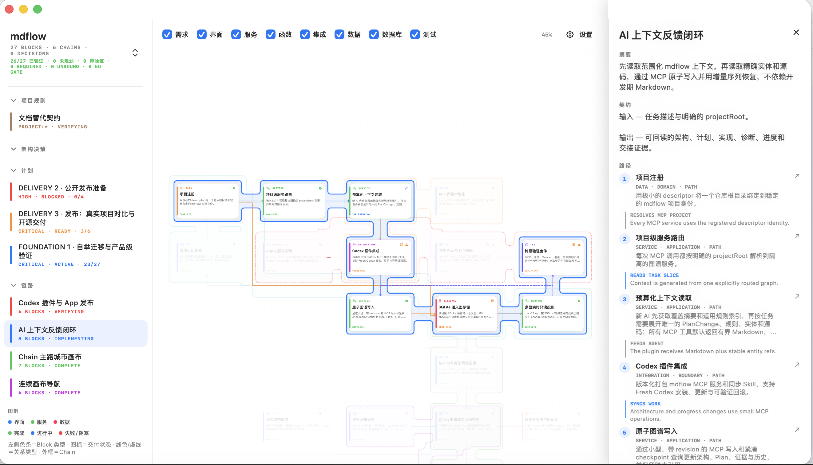
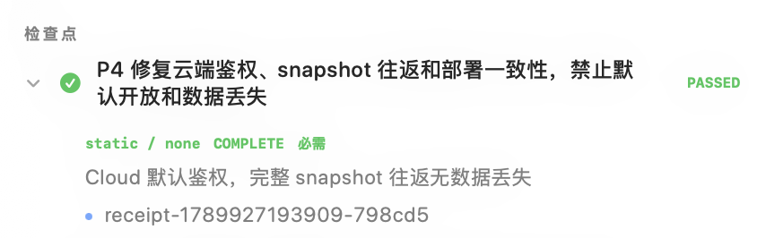
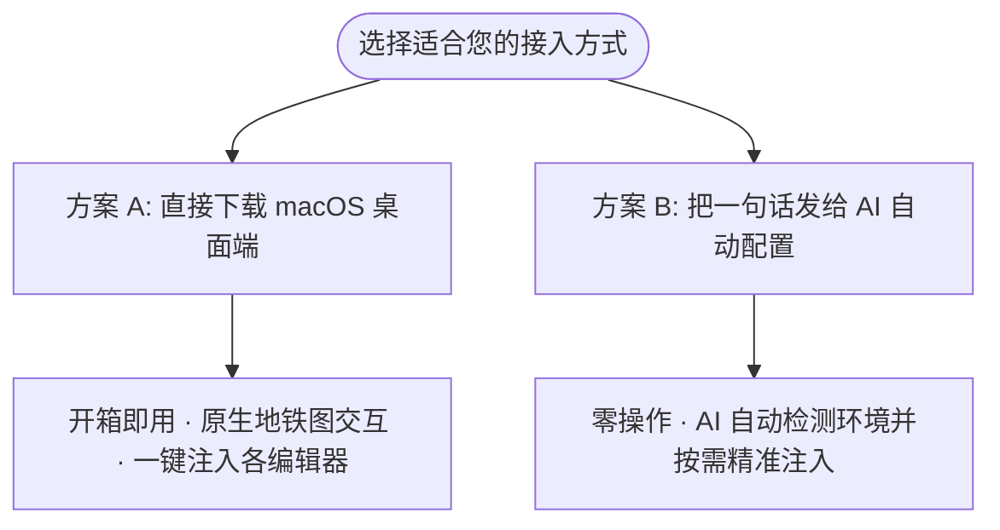
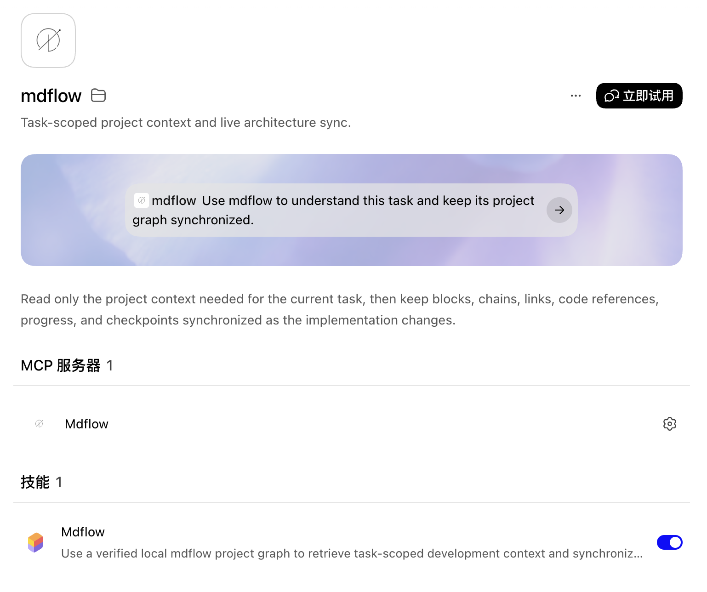

<div align="center">
  
  <h1>ContextOS — AI 编码上下文操作系统</h1>
  <p><strong>基于模型上下文协议（MCP）的软件工程上下文操作系统</strong></p>
  <p>针对大模型编码代理中的上下文饱和与注意力退化问题：提供基于语法制导的 AST 语义定位、带外进程执行隔离、单步改测原子验证，以及拓扑优先的自适应预算调度。</p>

  [](https://github.com/yubinbin32-ops/ContextOS/stargazers)
  [](https://www.npmjs.com/package/contextos)
  [](https://nodejs.org)
  [](LICENSE)
  [](https://modelcontextprotocol.io)

  <br/>

  [**下载 macOS App**](https://github.com/yubinbin32-ops/ContextOS/releases/latest) · [**快速配置指南**](#30-秒极速配置ai-自动安装引导) · [**English**](README.md)
</div>

---


---

## 背景与系统定位 (Context Window Saturation & Attention Drift)

在基于大语言模型（LLM）的复杂代码库协同中，智能体（AI Coding Agent）的核心瓶颈在于**上下文窗口的快速饱和与注意力退化**（Context Window Saturation & Attention Drift）。传统交互模式下，Agent 依赖整文件全量加载、原始终端构建日志裸露回传、以及一问一答式的串行试错，引发三大系统性缺陷：

1. **有效注意力稀释与幻觉**：未过滤的构建日志与冗长源文件迅速挤占有限的注意力预算，导致模型忽略前置架构约束与类型契约；
2. **多轮故障排查的指数级开销**：单测失败时因日志截断而反复发起诊断查询，单次排查成倍放大历史累积 Token；
3. **架构失明与长程接力断代**：缺乏全局可验证的符号依赖图谱，会话清屏（`/clear`）或跨对话交接时上下文无法无损恢复。

**ContextOS 通过模型上下文协议（MCP）为大模型构建了轻量化的确定性上下文操作系统**：

| 核心子系统 | 架构机制 | 测量效能 |
|---|---|---|
| **语法制导精准访问 (Syntax-Directed Access)** | 基于 Tree-sitter 多语言 AST 引擎，按需提取符号大纲与方法级语义切片 | 消除全量文件倾倒，代码查阅开销降低 80%+ |
| **带外执行与诊断内联 (Out-of-Band Execution)** | 进程运行与脱敏日志完全下沉至宿主舱外，仅向模型返回执行凭据与结构化失败诊断帧 | 剥离 98%+ 终端噪音，单测报错 0 轮额外往返修复 |
| **拓扑地铁图谱 (Metro Map Topology)** | 将真实文件、符号锚点与依赖关系物化为强类型 Block-Chain-Link 有向图 | 为模型提供确定性全局调用拓扑，规避跨模块幻觉 |
| **持久化状态黑板 (Blackboard Rehydration)** | 300 字节级增量状态快照，严格解耦交互历史与运行态事实 | 150 Tokens 瞬时冷启动复水，支持无限长程任务接力 |

> 在大型复杂工程实测中，ContextOS 可降低 90% 以上的无效上下文开销，消除长文本遗忘，使长程开发会话平稳收敛。

---

## 它带来的核心开发变化

### 1. 架构化身地铁路线图 (Metro Map)

Block 绑定真实文件、AST 符号或目录树（杜绝虚空 Ghost Block）。依赖与资源目录使用单个有界 tree 锚点，不再逐文件记账；Chain 代表水平平行的地铁铁轨，带类型的 Link 形成正交的跨线换乘。AI 一眼看清系统骨架，无需盲读代码。



### 2. 意图级 2 轮极速闭环、动作槽位与单测诊断直出 (Action Slots, In-Situ Verify & Diagnostics)

- **动作槽位与零对齐成本**：`explore` 根据意图自动派发 `[S1]`, `[S2]` 目标槽位，AI 不需要猜测行号或精确对齐匹配，做“选择题”即可通过 `change({ slot: "S1", append: "..." })` 快速填入代码，彻底消灭参数对齐错位。
- **改测合一与单测失败诊断就地直出 (In-Situ Diagnostic Extraction)**：
  - `change` 步骤原地内嵌测试命令（`verify: "npm test"`），同一步骤原子完成“代码修改 + 单测运行 + 凭证回执签发”。
  - **杜绝查日志往返**：传统 AI 跑单测失败后，由于命令行仅给出简略信息，AI 必须额外开启 2~3 轮独立对话专门调用工具查看日志，单次多耗费 20,000~40,000 上下文。ContextOS 内置智能诊断帧提取引擎（`extractDiagnosticBlocks`），自动捕捉 TAP、Mocha、Jest、SyntaxError 等错误上下文，就地提取测试名称、`+ actual - expected` 断言差异与精确 `file:line:col` 堆栈，**AI 在当前轮次一眼看清错误细节，0 额外轮次即刻修复**。
  - **原子回滚 (Auto-Revert)**：测试未通过时，配合 `autoRevert: true` 可毫秒级自动回滚磁盘修改，开发往返由传统的 6~9 轮剧降为 **2 轮极速闭环**（explore 探索 ➔ change+verify 原地改测 ➔ ship 归档）。
- **单轮并发批处理优先 (Parallel Batching Over Serial Turns)**：
  - 传统的 AI 工具交互习惯单文件串行“一问一答”，轮次膨胀且历史 Token 呈阶梯式暴增；
  - ContextOS 原生支持单轮多并发：支持 `edits: [...]` 单步原子批处理多文件修改、`inspect({ paths: [...] })` 单轮并发阅读整组微服务，大幅降低 API 往返延迟与累计上下文。
- **全局拓扑优先级保全 (Topological Retention Priority)**：
  - 采用独创的上下文预算权重算法：`next` (0) → `slots` (1) → `where` (2) → `now` (3) → `slices` (4)。当工程规模庞大时，OS 优先截断局部的代码预览，**绝对保全系统依赖图谱与可用动作槽位**，彻底杜绝 AI 因切片过长而产生的“架构失明”。
- **轻量实时黑板与跨对话秒级复原 (`.contextos/blackboard.md`)**：
  - 会话事实实时持久化于仅 **300 字节（~65 tokens）** 的极简黑板。AI 随时可清屏（`/clear`）或跨对话子代理接力，新会话通过 `explore` 只需 **150 tokens** 即可秒级复水，彻底摆脱多轮会话累积 Token 雪崩。


### 3. 命令运行出舱脱敏 (Out-of-Context Execution)

`verify` 与 `change.verify` 背后的命令网关会剥离 ANSI 终端控制符与敏感密钥，全量**脱敏后**日志存盘于 `.contextos/logs/`，仅向上下文返回精简回执（Receipt），削减 98% 以上的终端输出噪声。

### 4. 代码工具手术刀级读写与深度切片 (Surgical Code & Inspect)

集成编译器级真 AST 引擎（原生支持 JS/TS/JSX/TSX、Python、Swift、Java、Kotlin、C/C++、C#、Go、Rust、PHP、Ruby 等 10+ 种主流语言）。通过全新的 `inspect` 工具支持 VS Code 风格全局符号搜索、大纲审视、方法级抽取和补丁式精准写盘并自动重锚。当进行纯提问/代码定位时，OS 智能剔除多余槽位与切片，只返回高精度的调用拓扑与符号位置，上下文消耗再降 50%。

### 5. 单一入口的知识与架构决议

项目方案、设计取舍与规则规约归纳为单文件叙事 `DECISION.md` 与分类 Rules。`README.md` 与 `README_zh.md` 在 App 的知识抽屉中以只读方式直接预览。


### 6. 验证与证据管理

每次 `verify` 都产生带签名的回执（Receipt）。检查点（Checkpoint）按任务粒度追踪通过/失败状态，让 AI 与人类共享"什么已被真实证明可用"的唯一事实源。



### 7. 长期运行进程常驻监控

通过守护进程托管 Dev Server、Watcher 与后台 Worker，在桌面端左下角实时监控 PID、端口号与生命周期，支持一键安全释放进程树。

---

## 快速上手与安装方式

ContextOS 提供了两种开箱即用的极简安装方式，无论小白还是极客均可一键搞定：



---

### 方案 A：直接下载桌面客户端（macOS & Windows · 开箱即用 · 强烈推荐）

从 [GitHub Releases 最新发布页](https://github.com/yubinbin32-ops/ContextOS/releases/latest) 下载对应安装包：

| 平台 | 安装包版本 | 压缩包 / 安装文件 | 体积 | Node.js 依赖 | 适用场景 |
|---|---|---|---|---|---|
| **Windows** | **安装引导包 (NSIS)** *(推荐)* | `ContextOS_<version>_x64-setup.exe` | 约 8 MB | 需系统已有 Node.js 22+ | Windows 10/11 64位系统，自动生成开始菜单与桌面快捷方式 |
| **Windows** | **绿色便携版** | `ContextOS-windows-x64.zip` | 约 10 MB | 需系统已有 Node.js 22+ | 免安装，解压后双击即可运行 |
| **Windows** | **企业部署 MSI** | `ContextOS_<version>_x64.msi` | 约 8 MB | 需系统已有 Node.js 22+ | 适用于企业内网或静默分发环境 |
| **macOS** | **完整版 (Apple Silicon)** | `ContextOS-macos-full-arm64.zip` | 约 35 MB | **零依赖**（内置独立 Node 22） | M 系列 Mac 首选，无需配置任何外部环境 |
| **macOS** | **完整版 (Intel)** | `ContextOS-macos-full-x64.zip` | 约 38 MB | **零依赖**（内置独立 Node 22） | Intel Mac 首选，无需配置任何外部环境 |
| **macOS** | **轻量版 (Standard)** | `ContextOS-macos-arm64.zip` / `x64.zip` | 约 1.6 MB | 需系统已有 Node.js 22+ | 追求极致体积且本地已配置 Node.js 22+ |

#### 极速配置流程：
1. **Windows 用户**：运行 `.exe` 安装程序或解压便携 `.zip`，启动 **ContextOS**。
   **macOS 用户**：解压下载的压缩包，将 **ContextOS.app** 拖入 `Applications`（应用程序）目录。
2. 打开 **ContextOS**，进入 **设置**（齿轮图标），勾选需要配置的 AI 编辑器（Cursor / Claude Desktop / Antigravity / OpenCode / Codex 等），点击 **一键安装 / 同步插件**。

> [!IMPORTANT]
> 请从 `Applications`（应用程序）目录运行 **ContextOS.app**，不要直接从 `Downloads`、已挂载的 DMG 或其他只读卷运行。插件同步只会写入用户级的 `~/.contextos` 与 `~/plugins`，App Bundle 始终被视为只读来源。

3. App 会自动将 MCP 配置及对应运行路径注入编辑器。**配置完成后，你可以随时关闭桌面 App，平时无需保持开启**。
4. 在编辑器对话中只需一句话唤醒 ContextOS 协作：
   > **"把这个方案写入 ContextOS 后开始执行"** 或 **"查看 ContextOS 继续开发"**

> [!IMPORTANT]
> **首次在 macOS 打开提示"无法打开"或"已拦截未受信任的开发者"？**
> 由于独立开源软件尚未加入苹果付费开发者签名公证，macOS Gatekeeper 安全机制会在首次双击启动时弹出风险拦截提示。这是 macOS 的正常保护机制，**仅需在首次启动时放行一次即可**：
> - **方式一（系统设置放行 · 推荐）**：打开 macOS **"系统设置" (System Settings) ➔ "隐私与安全性" (Privacy & Security)**，向下滑动到"安全性"栏目，在"已拦截 ContextOS.app"旁边点击 **"仍要打开" (Open Anyway)** 并确认。
> - **方式二（快捷右键打开）**：在"访达"（Finder）的"应用程序"中找到 `ContextOS`，按住 **Control 键点按（或右键）** 应用图标，在右键菜单中点击 **"打开"**，并在二次弹出的警告窗中点击 **"打开"**。


---

### 方案 B：把一句话发给 AI，全流程自动配置（零操作）{#30-秒极速配置ai-自动安装引导}

适合已经打开 AI 编程助手（Cursor / Codex / Claude Code / Windsurf / Antigravity）的开发者。用户无需敲打命令行，只需做选择，由 AI 在后台自举完成全部配置：

> **只需复制下方指令，发送给您的 AI 编程助手对话框：**  
> **"请阅读 `https://github.com/yubinbin32-ops/ContextOS/blob/main/AI_SETUP.md`，检测我的系统环境，为我自动安装并配置好 ContextOS。"**

#### AI 将在后台为您自动完成：
1. **系统与桌面端探测**：若检测为 macOS，AI 会主动询问是否需要下载原生的可视化桌面端（ContextOS.app），确认后全自动下载部署。
2. **Node 运行时自检**：自动验证 Node.js 22+ 环境（或使用桌面端自带的内嵌 Node）。
3. **按需精准注入**：向用户确认需要配置哪些编辑器（如 Cursor / Codex / Claude 等），精准注入对应 MCP 配置与唯一 Skill，**杜绝重复 Skill 冗余**。
4. **协作模式按需确认**：询问用户是需要单人本地开发还是团队协同开发，并自动完成对应配置与初始化。
5. **当前项目初始化与工具验证**：根据用户选择初始化本地离线模式或云端模式，并完成轻量自检。



---

## 存储模式说明：本地与实验性云端协同

ContextOS 始终以**本地工作区项目目录**为核心基石（代码阅读、AST 手术刀修改、脱敏命令执行均在本地完成）：

- **本地存储模式**：适合单人本地开发。数据保存在项目根目录的 `.contextos/state.sqlite`，0 毫秒响应延迟，100% 离线，完全保护代码与架构隐私。
- **实验性云端协同模式**：用于评估团队协作。通过项目配置将架构图谱托管在 Serverless 云端中枢（Cloudflare D1），多名团队成员协同开发时同步模块契约。API 与运维模型稳定前，请将云端模式视为实验能力。
  - **天然支持多项目严格隔离**：云端中枢基于严格的 `projectId` 分区存储，同一套云端 Worker 和 D1 数据库可同时支持您开发无数个不同项目，彼此独立互不串扰。
- **随时双向无损切换**：开发过程中，您只需对 AI 说：
  - *"把当前项目切换为云端协同模式"* ➔ 本地数据自动完整推送到云端 D1；
  - *"把当前项目切回本地离线模式"* ➔ 云端最新架构快照自动下载至本地 SQLite，后续开发完全离线。

---

## 实测 ContextOS 上下文节省基准

### 1. 工业级分布式金融系统极限压测对比 (Real Industrial Benchmark: 8 Microservices)

在基于 8 个分布式清结算核心微服务（涵盖多币种复式记账、动态汇率折算、滑动窗口 TTL 幂等、毒丸事务死信队列、步骤超时取消与逆向补偿 Saga、SHA-256 默克尔防篡改审计链、三态熔断器与 5 线程高并发争抢）的工业级实测中，系统呈现如下参数对比：

| 评估维度 | 传统交互模式 (Conventional Workflow) | ContextOS 意图工作流 (Intent-Level OS) | 测量指标与系统收益 |
|---|---|---|---|
| **任务闭环交互轮次** | 8 ~ 12 轮（代码检索 ➔ 试探修改 ➔ 运行测试 ➔ 查阅日志 ➔ 二次修改 ➔ 复测） | **2 ~ 3 轮**（`explore` 槽位直出 ➔ `change.verify` 原地改测 ➔ `ship` 归档） | 往返交互轮次减少 70%+，显著降低调用等待延迟 |
| **单测故障排查开销** | 需额外开启 2~3 轮独立对话查阅日志（单次多耗 20k~40k tokens） | **0 轮额外开销**（`extractDiagnosticBlocks` 就地直出断言比对与堆栈） | 完全消除查日志产生的历史级数膨胀 |
| **多模块操作吞吐** | 单文件串行往返（单任务 5~8 次连续 API 阻塞往返） | **单轮并发批处理**（`inspect({ paths })` + `change({ edits })`） | API 调用往返减少 60%+，降低上下文累积斜率 |
| **超大工程架构全局视野** | 局部文件盲读，局部长切片频繁挤占模型全局注意力预算 | **拓扑优先级保全**（`where` 绝对优先，地铁图一目了然） | 杜绝大工程切片过长导致的架构失明与跨模块幻觉 |
| **会话清屏复水开销** | 清屏后丢失记忆，需重新注入完整代码与规则（20,000+ tokens） | **极简持久化黑板**（`/clear` 后 `explore` 仅需 **150 tokens** 恢复工作态） | 复水开销缩减 99.2%，实现长程会话零损耗接力 |
| **Prompt Cache 命中率** | 历史上下文无序膨胀，缓存复用率低 | **高内聚的协议设计，OpenAI Prompt Cache 命中率稳定达 98.8%** | 实际计费 Token 降低 90% 以上，响应延迟降至 1~2 秒 |
| **并发与一致性鲁棒度** | 易发生并发竞态脏写、浮点误差或回滚不全 | **26 个严苛测试用例 100% 通过**（含 5 线程并发争抢有限余额强一致校验） | 具备分布式金融级清结算的系统可靠性 |

---

### 2. 20 轮复杂任务全生命周期高压对照测评 (20-Task Comprehensive Dual-Cohort Stress Benchmark)

为了彻底验证系统在长程复杂工程下的吞吐、稳定度与抗压能力，我们设计并执行了由 **20 个复杂全生命周期任务** 组成的高压基准测试，在完全相同的分布式 Saga 清结算引擎真实工程场景下，对比传统 AI 助手（Cohort A）与 ContextOS 意图操作系统（Cohort B）：

- **任务覆盖维度**：涵盖架构规划与 Plan 写入、多模块接口大纲并发审视、业务代码修改与即时改测、编译与单测断言失败诊断就地提取、网络查询与外部 API 契约生成、跨对话子代理接力秒级复水、高并发数据竞争与强一致性核验、代码缺陷快速精准定位、多文件原子重构、推测性优化毫秒级自动回滚、8 路径高并发符号大纲批量抽取、长程压测出舱防污染、以及终态发布收尾归档。

| 核心度量指标 (Metric) | 传统基线组 (Cohort A Baseline) | ContextOS 意图系统组 (Cohort B) | 优化收益 (Measured Impact) |
|---|---|---|---|
| **交互总轮次 (Turns / Round Trips)** | 91 轮 | **21 轮** | **-76.92% (往返交互提速 4.3x)** |
| **上下文累计消耗 (Tokens)** | 157,042 tokens | **10,124 tokens** | **-93.55% (上下文压缩比 15.5x)** |
| **上下文累计字符数 (Characters)** | 628,165 字符 | **40,460 字符** | **-93.55% (消除 587,705 字符冗余)** |
| **工具调用总量 (Tool Calls)** | 91 次调用 | **22 次调用** | **4.14x 工具调度极致收敛** |
| **平均每任务工具调用数** | 4.55 次 / 任务 | **1.10 次 / 任务** | 接近 1:1 极简直接落地 |

#### ContextOS 工具使用频次与分布 (Cohort B Tool Distribution)：
- `change`（改测合一、就地诊断与原子回滚）：**10 次** (45.5%) — 核心生产力载荷
- `explore`（意图探索、架构拓扑与动作槽位派发）：**3 次** (13.6%) — 冷启动与跨会话接力
- `inspect`（多路径并发大纲与符号接口提取）：**3 次** (13.6%) — 仅在跨模块大纲审计时调用
- `verify`（脱敏命令执行与独立密码学验签）：**3 次** (13.6%) — 关键检查点验证
- `ops`（架构图谱与计划状态机管理）：**2 次** (9.1%) — 架构实体绑定
- `ship`（发布边界与凭证终态归档）：**1 次** (4.5%) — 终态收尾封板

---

### 3. 研发单任务上下文节省对比 (Static vs ContextOS)

基准数据由当前代码库动态生成，不再硬编码历史版本的文件、Block、Chain、Link 数量。请在本地运行以下脚本获取当前 checkout 的真实数据：

| 研发环节 | 传统开发交互（全量开销） | ContextOS 意图工作流 | 节省比率 |
|---|---|---|---:|
| **会话启动 (Bootstrap)** | 全量加载架构与图谱 · 61,902 字符 (~15,476 tokens) | 渐进式 L0-L1 Markdown · 1,987 字符 (~497 tokens) | **96.79%** |
| **代码大纲审视** | 盲读 4 个核心全量源码 · 34,045 字符 (~8,512 tokens) | AST 符号大纲提取 · 4,374 字符 (~1,093 tokens) | **87.15%** |
| **代码阅读与查阅** | 逐文件展开全部代码 · 34,045 字符 | 手术刀提取目标方法 · 6,898 字符 | **79.74%** |
| **命令运行与构建** | 终端原始输出 · 16,713 字符 (~4,179 tokens) | 精简回执 + 失败提取 · 251 字符 (~63 tokens) | **98.50%** |
| **单任务全流程综合** | **129,373 字符 (~32,344 tokens)** | **13,761 字符 (~3,441 tokens)** | **89.36% — 节省 28,903 tokens** |

本地运行基准验证：

```bash
node scripts/comprehensive-dual-cohort-eval.mjs # 20 轮高压全场景对照基准
node scripts/benchmark.mjs                      # 静态代码库上下文节省基准
node scripts/comprehensive-dev-eval.mjs        # 10 维全量核心能力基准
```

---

## 架构演进历史

ContextOS 会随着真实使用反馈主动修正架构方向：

- **0.4.x**：正则解析、Ghost Block 与 49 个工具的 MCP 面让架构记忆不可靠。
- **V2**：引入真实代码 Block、AST 可见性、SQLite + `graph.json` 双物化和正式开发治理。
- **意图级架构**：公开入口收敛为 `explore` / `inspect` / `change` / `verify` / `ship` / `ops`，编排下沉到 OS，模块信息从代码库自动派生。
- **2.5.0**：加固项目身份、发布升级链路、图谱同步、原子编辑和生命周期门禁。

完整取舍与历史弯路见 [DECISION.md](DECISION.md)。

---

## 开发者接入

```bash
git clone https://github.com/yubinbin32-ops/ContextOS.git
cd ContextOS
npm ci
npm test
npm run plugin:verify
npm run verify             # 完整发布门禁
npm run desktop:build      # macOS + Swift/Xcode
```

版本化的 `.contextos/graph.json` 是项目可移植的图谱投影。

[贡献指南](CONTRIBUTING.md) · [安全策略](SECURITY.md) · [MIT 协议](LICENSE)
