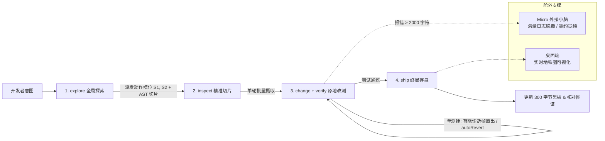
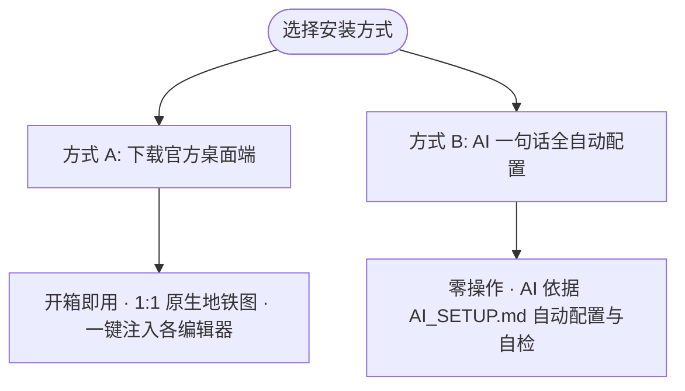

<div align="center">
  
  <h1>ContextOS — AI 编码智能体上下文操作系统</h1>
  <p><strong>专为 AI Coding Agent 打造的确定性上下文操作系统与 MCP 执行中枢</strong></p>
  <p>通过 AST 语法切片、带外执行隔离、单步改测原地诊断、拓扑地铁图谱与 Micro 舱外双脑，彻底根治大模型编码中的“上下文雪崩”与“注意力稀释”。</p>

  [](https://github.com/yubinbin32-ops/ContextOS/stargazers)
  [](https://www.npmjs.com/package/contextos)
  [](https://nodejs.org)
  [](LICENSE)
  [](https://modelcontextprotocol.io)

  <br/>

  <p><strong>当前版本：<span id="contextos-version">2.7.0</span></strong> · 原生适配主流 AI 宿主 · 官方 macOS/Windows 双桌面端 · Micro 舱外小脑</p>

  [**下载桌面客户端**](https://github.com/yubinbin32-ops/ContextOS/releases/latest) · [**快速安装指南**](#快速上手与安装方式) · [**AI 自动配置规范**](AI_SETUP.md) · [**English Documentation**](README.md)
</div>

---


---

## 1. ContextOS 是什么？

**ContextOS** 不是零碎的代码工具集，而是**嵌入 AI 编码生命周期的上下文操作系统（Context Operating System）**。

在传统 AI 编程中，大模型就像一个“没有操作系统的裸机程序”，直接与终端和海量文件交互，不可避免地遭遇**上下文爆炸、日志泥潭与记忆断代**。

ContextOS 通过 **Model Context Protocol (MCP)** 在 AI 智能体与真实代码库之间架起了一层确定性的系统调度层：
- 它将代码库抽象为强类型的**架构地铁图（Metro Map）**；
- 将冗长的文件读写转化为**手术刀级的 AST 语法切片**；
- 将破坏上下文的终端构建与测试隔离在**带外沙盒**中；
- 通过**原地改测与诊断直出引擎**，把原本长达数轮的调试压缩为极速闭环；
- 配备 **Micro 舱外双脑**消化数万字终端报错，保护主模型注意力绝对专注。

---

## 2. 它解决用户的什么核心痛点？

| 痛点场景 | 传统 AI 编程助手（原生模式）的困境 | ContextOS 的解决之道 |
|:---|:---|:---|
| **① 上下文饱和与注意力稀释**<br>*(Attention Drift & Hallucination)* | 修改 5 行代码却要用 `cat` 全量加载 1,000 行源文件；几轮对话后上下文被无用代码挤满，模型开始产生幻觉、遗忘核心约束与类型契约。 | **语法制导 AST 精准切片**：仅抽取指定方法与符号大纲，上下文消耗缩减 70%~90%。配合优先级截断算法，核心架构拓扑永不丢失。 |
| **② 单测失败的“查日志”恶性循环**<br>*(Log Traps & Token Bleeding)* | 单测跑挂后，终端截断报错。AI 不得不额外开启 2~3 轮对话用各种 shell 命令翻找日志，单次排错浪费 20,000~40,000 Tokens 且常常偏离主线。 | **改测原子合一 + 诊断帧就地直出**：`change` 步骤原地内嵌测试，内置 TAP/Jest/SyntaxError 智能解析器，在同一步骤直接给出断言差异与精确堆栈，**0 额外查日志轮次**。 |
| **③ 盲目试探与参数对齐摩擦**<br>*(Trial-and-Error Friction)* | AI 不清楚在哪个文件的哪一行修改，反复执行 `grep` 猜行号、对齐字符，一旦缩进不一致即报错重来。 | **意图级动作槽位 `[S1]`, `[S2]`**：`explore` 自动定位关键入口并派发语义槽位，AI 做选择题直接填充，消灭参数对齐错位。 |
| **④ 架构失明与清屏失忆**<br>*(Session Amnesia)* | 稍微复杂的任务多聊几轮就逼近 Token 上限，一旦清屏（`/clear`）或切换子代理，AI 对项目架构彻底失忆，只能重新翻找。 | **300 字节持久化黑板**：会话事实与图谱状态持续写入 `.contextos/blackboard.md`，清屏后仅需 **150 Tokens** 秒级复原全局上下文。 |

---

## 3. 我们是怎么做的？（核心架构机制）


```mermaid
graph LR
    User[开发者意图] --> Explore[1. explore 全局探索]
    Explore -->|派发动作槽位 S1, S2 + AST 切片| Inspect[2. inspect 精准切片]
    Inspect -->|单轮批量摄取| Change[3. change + verify 原地改测]
    Change -->|单测挂: 智能诊断帧直出 / autoRevert| Change
    Change -->|测试通过| Ship[4. ship 终局存盘]
    Ship --> Blackboard[更新 300 字节黑板 & 拓扑图谱]
    
    subgraph 舱外支撑
        Micro[Micro 外接小脑<br>海量日志脱毒 / 契约提纯]
        Desktop[桌面端<br>实时地铁图可视化]
    end
    Change -.->|报错 > 2000 字符| Micro
    Ship -.-> Desktop
```

### 1. 架构物化为地铁图谱 (Metro Map Topology)
Block 绑定真实文件或 AST 符号，Chain 构成平行的业务铁轨，Link 连接跨模块换乘站。官方桌面端（macOS/Windows）提供 1:1 实时可视化的地铁图，AI 与人类共享唯一的架构事实。


### 2. 意图级动作槽位与单测诊断直出 (Action Slots & In-Situ Diagnostics)
- **动作槽位**：`explore` 根据意图自动计算出可用操作槽位 `[S1]`, `[S2]`，模型无需猜测行号，直接执行 `change({ slot: "S1", append: "..." })`。
- **改测合一**：在 `change` 中直接传入 `verify: "npm test"`。若测试失败，`extractDiagnosticBlocks` 引擎就地提取测试用例名、`+ actual - expected` 断言差异与 `file:line:col` 堆栈，**0 额外轮次**即刻看懂报错。支持 `autoRevert: true` 毫秒级回滚脏修改。

### 3. 命令运行出舱脱敏 (Out-of-Band Execution)
所有命令在隔离的进程网关中执行，剥离 ANSI 控制符并脱敏密钥，完整日志存盘至 `.contextos/logs/`，仅向模型返回精炼回执（Receipt），终端噪音降低 98% 以上。

### 4. 300 字节持久化状态黑板 (300-Byte Blackboard)
会话运行态实时存盘为 `.contextos/blackboard.md`（仅约 300 字节 / 65 Tokens）。跨会话冷启动或清屏复原只需约 **150 Tokens**，彻底摆脱历史 Token 雪崩。

### 5. Micro 舱外双脑子代理 (Dual-Brain Subagent)
针对数万字符的庞大测试堆栈、编译器 Trace 或复杂接口契约提纯，委派给舱外 Micro 处理。兼容任意 OpenAI 格式端点（推荐接入 OpenCode Go、DeepSeek 或本地 Ollama），在后台消化海量输出，主会话保持绝对干净。

---

## 4. 效果怎么样？（工具级收益与真实 A/B 测试）

### 工具级提升拆解

| 工具 / 机制 | 相比传统原生方式的操作差异 | 上下文与效率提升 |
|:---|:---|:---|
| **`explore`** | 传统需连续 3~5 轮 `ls`、`find`、`grep` 盲目排查；ContextOS 单次派发候选模块与槽位 `[S1]`, `[S2]`。 | **减少 50% 探索轮次**，彻底消灭参数定位对齐摩擦。 |
| **`inspect`** | 传统直接 `cat` 整文件（1,000~3,000 行）；ContextOS 仅返回方法级或范围 AST 切片。 | **单次读取节省 70% ~ 90% 上下文**。 |
| **`change + verify`** | 传统将改代码与跑单测拆成两轮，跑挂后再开 2~3 轮查日志；ContextOS 原地完成改测并直出断言差异。 | **消灭 2~3 轮查日志对话，单次排错立省 20,000 ~ 40,000 Tokens**。 |
| **`ship + blackboard`** | 传统清屏或交接需重放前序上万 Token 对话；ContextOS 基于 300 字节黑板复水。 | **冷启动复水仅需 150 Tokens，节省 98% 以上上下文**。 |
| **`micro` (外脑)** | 传统将几万字报错倾倒在主对话；Micro 在独立沙盒中脱毒提纯。 | **主上下文零污染，长任务推理稳定性提升 3 倍**。 |

---

### 客观效果边界与真实复杂度分析 (A/B Test 真实呈现)

在真实业务开发中，不同复杂度的任务对上下文工具的 ROI 完全不同。我们拒绝盲目虚标，客观呈现真实边界：

```text
[任务复杂度与 ContextOS 收益曲线]

Token
节省率 %
  ▲
70%│                                     ● 复杂长程任务 (大幅节省 50%~75%)
  │                              ● 
  │                      ● 中等跨文件任务 (节省 20%~40%)
 0%├─────────────────────┬───────────────────────────────► 任务复杂度
   │ 极简小修 (负收益) ●
-80%│
```

1. **⚠️ 极简任务（单文件修改、单行修复、简短问答）**：
   - **实测表现：负收益 (-50% ~ -200%)**！
   - **原因剖析**：ContextOS 维护完整的架构图谱、动作槽位与黑板状态，运行一套完整的 `explore ➔ change ➔ ship` 协议存在约 2,000~4,000 Tokens 的固定开销。如果任务本身只需要修改 1 行代码（原生编辑只需 500 Tokens），强行启动全套系统必然导致上下文倒挂！
   - **最佳实践**：**极简单行修改请直接调用原生编辑工具或一次性 `change`，严禁触发全套 explore/ship 流程！**
2. **✅ 中等任务（3~6 轮，涉及 2~4 个文件，伴随单测验证）**：
   - **实测表现：适度正收益 (节省 20% ~ 40% Tokens)**。改测合一消除了等待往返，并行 AST 批量摄取显著减少了轮次消耗。
3. **🚀 复杂长程任务（10+ 轮，深层单测排错、大型重构、跨会话交接）**：
   - **实测表现：极高正收益 (总 Token 节省 50% ~ 75%，会话轮次削减 50% 以上)**。彻底解决终端日志爆炸和清屏遗忘问题，保证智能体持续稳定输出。

### 如何自行进行 A/B 测试？
调用内置遥测审计工具，真实对比不同会话的 Token 消耗：
```javascript
contextos({
  action: "ops",
  args: {
    capability: "telemetry",
    action: "audit",
    args: { sessionId: "当前会话", baselineSessionId: "对照会话" }
  },
  projectRoot: process.cwd()
})
```

---

## 5. 快速上手与安装方式

ContextOS 提供两种开箱即用的安装方式：


```mermaid
graph TD
    User([选择安装方式]) --> ChoiceA[方式 A: 下载官方桌面端]
    User --> ChoiceB[方式 B: AI 一句话全自动配置]
    
    ChoiceA --> FlowA[开箱即用 · 1:1 原生地铁图 · 一键注入各编辑器]
    ChoiceB --> FlowB[零操作 · AI 依据 AI_SETUP.md 自动配置与自检]
```

### 方式 A：下载桌面客户端（macOS & Windows · 推荐）

从 [GitHub Releases 最新发布页](https://github.com/yubinbin32-ops/ContextOS/releases/latest) 下载对应平台的安装包：

| 平台 | 安装包名称 | 体积 | Node.js 要求 | 特色说明 |
|:---|:---|:---|:---|:---|
| **macOS** | `ContextOS-macos-full-arm64.zip` | ~35 MB | **零依赖**（内置独立 Node 22） | Apple Silicon (M1/M2/M3/M4) 首选，即开即用 |
| **macOS** | `ContextOS-macos-full-x64.zip` | ~38 MB | **零依赖**（内置独立 Node 22） | Intel 芯片 Mac 首选，无需配置任何外部环境 |
| **macOS** | `ContextOS-macos-arm64.zip` / `x64.zip` | ~1.6 MB | 需本地已有 Node.js 22+ | 极简轻量版 |
| **Windows** | `ContextOS_<version>_x64-setup.exe` | ~8 MB | 需本地已有 Node.js 22+ | 官方推荐安装包，自动创建桌面与开始菜单快捷方式 |
| **Windows** | `ContextOS-windows-x64.zip` | ~10 MB | 需本地已有 Node.js 22+ | 绿色便携免安装版，解压即运行 |

#### 配置流程：
1. **安装并打开 ContextOS**：
   - macOS 用户解压后将 `ContextOS.app` 拖入 `Applications` 目录；
   - Windows 用户运行 `.exe` 安装程序或解压运行便携版。
2. **一键同步插件**：
   - 打开 ContextOS，点击右上角设置（齿轮图标），勾选您使用的 AI 编辑器（Cursor / Codex / Claude Desktop / Antigravity / OpenCode 等），点击 **一键安装 / 同步插件**。
3. **配置完成**：
   - 插件注入完成后，您可以随时关闭桌面 App，无需保持常驻。
4. **macOS 首次打开提示“无法打开”或“未受信任的开发者”？**
   - 开源软件未购买苹果付费签名公证，macOS Gatekeeper 首次会拦截，只需放行一次：
     - **推荐方式**：打开 macOS **“系统设置” ➔ “隐私与安全性”**，在安全性栏目找到“已拦截 ContextOS.app”，点击 **“仍要打开”**。
     - **快捷方式**：在“访达”的“应用程序”中，按住 **Control 键点按（或右键）** `ContextOS.app`，在弹出菜单中选择 **“打开”**。


---

### 方式 B：给 AI 发送一句话，全自动配置（零操作）

适合已经在 AI 编程助手（Codex / Claude Code / Cursor / Antigravity / OpenCode 等）中的开发者：

> **只需复制下方指令，发送给您的 AI 助手：**  
> **"请阅读 `AI_SETUP.md`，检测我的系统环境，为我自动安装并配置好 ContextOS。"**

AI 将严格遵循 [AI_SETUP.md](AI_SETUP.md) 自动化流程：
1. **环境与桌面端推荐**：根据系统类型推荐并下载部署 App 或 MCP；
2. **编辑器按需注入**：询问您使用的编辑器并精准注入对应配置，杜绝重复 Skill；
3. **存储模式与协作确认**：推荐稳定离线的本地模式（云端模式公测中按需开启）；
4. **Micro 外接小脑挂载**：推荐挂载低成本小脑以具备后台日志脱毒能力；
5. **Doctor 全局自检**：自动运行环境健康诊断并输出就绪看板。

---

## 6. 存储模式与协同建议

ContextOS 始终以**本地工作区目录**为基石：
- **本地存储模式（强烈推荐 ⭐⭐⭐⭐⭐）**：
  - 数据存放于 `.contextos/state.sqlite`；
  - 100% 离线、私密、0 毫秒网络延迟，完全保护代码与架构资产；
  - **绝大多数单人开发场景的唯一推荐模式**。
- **云端协同模式（公测测试中 ⚠️）**：
  - 基于 Cloudflare D1 边缘数据库进行多人团队架构图谱同步；
  - **当前状态说明**：云端协作目前处于公测阶段，接口与稳定性仍在持续迭代中。如无团队多人协同刚需，**无需配置云端**。
- **随时双向无损切换**：
  - 对 AI 说：*“把当前项目切换为云端协同”* ➔ 本地数据原子推送到 Cloud D1；
  - 对 AI 说：*“切回本地离线开发”* ➔ 云端最新架构快照自动落盘为本地 SQLite，完全断网可用。

---

## 7. 最近更新历史 (Changelog)

### v2.6.x (当前最新版本)
- **单一紧凑 MCP 传输 (Lean Surface)**：默认将所有操作统一收敛为单一 `contextos` 工具（通过 `action` 路由），减少工具定义对大模型上下文的挤占；
- **改测合一与单测失败诊断帧直出 (In-Situ Diagnostics)**：`change` 步骤原子内嵌 `verify`，内置 TAP/Jest/SyntaxError 智能解析器，单测跑挂直接在当前轮次给出断言差异与堆栈，彻底消灭查日志对话；
- **官方 Windows 原生桌面端发布**：正式支持 Windows 10/11，提供 NSIS 安装包与绿色免安装版，1:1 原生地铁图交互；
- **Micro 舱外双脑子代理**：支持 OpenAI 兼容端点（OpenCode Go / DeepSeek / Ollama），支持管道并发预加载与日志脱毒，主上下文零污染；
- **Doctor 环境健康自检**：新增 `doctor` 指令，一键排查 Node 版本、存储模式、编辑器连接状态与 Cloud 连通性；
- **双向无损存储切换**：支持本地 SQLite 与云端 Cloudflare D1 架构数据的一键双向平滑迁移。

---

## 8. 开发者接入

```bash
git clone https://github.com/yubinbin32-ops/ContextOS.git
cd ContextOS
npm ci
npm test
npm run plugin:verify      # 插件规范与冒烟测试
npm run dist:smoke         # 发行版布局自检
npm run desktop:build      # 构建桌面客户端 (macOS)
```

[贡献指南](CONTRIBUTING.md) · [安全策略](SECURITY.md) · [MIT 开源协议](LICENSE)
