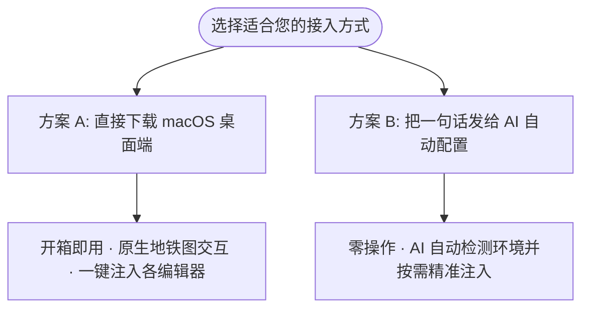

<div align="center">
  
  <h1>ContextOS — AI 编码上下文操作系统</h1>
  <p><strong>基于模型上下文协议（MCP）的软件工程上下文操作系统</strong></p>
  <p>针对大模型编码代理中的上下文饱和与注意力退化问题：提供基于语法制导的 AST 语义定位、带外进程执行隔离、单步改测原子验证，以及拓扑优先的自适应预算调度。</p>

  [](https://github.com/yubinbin32-ops/ContextOS/stargazers)
  [](https://www.npmjs.com/package/contextos)
  [](https://nodejs.org)
  [](LICENSE)
  [](https://modelcontextprotocol.io)

  <br/>

  <p><strong>版本：<span id="contextos-version">2.6.1</span></strong> · 五平台 MCP 与 Skill 适配 · Micro 多轮子代理</p>

  [**下载 macOS App**](https://github.com/yubinbin32-ops/ContextOS/releases/latest) · [**快速配置指南**](#30-秒极速配置ai-自动安装引导) · [**English**](README.md)
</div>

---


---

## 背景与系统定位 (Context Window Saturation & Attention Drift)

在基于大语言模型（LLM）的复杂代码库协同中，智能体（AI Coding Agent）的核心瓶颈在于**上下文窗口的快速饱和与注意力退化**（Context Window Saturation & Attention Drift）。传统交互模式下，Agent 依赖整文件全量加载、原始终端构建日志裸露回传、以及一问一答式的串行试错，引发三大系统性缺陷：

1. **有效注意力稀释与幻觉**：未过滤的构建日志与冗长源文件迅速挤占有限的注意力预算，导致模型忽略前置架构约束与类型契约；
2. **多轮故障排查的指数级开销**：单测失败时因日志截断而反复发起诊断查询，单次排查成倍放大历史累积 Token；
3. **架构失明与长程接力断代**：缺乏全局可验证的符号依赖图谱，会话清屏（`/clear`）或跨对话交接时上下文无法无损恢复。

**ContextOS 通过模型上下文协议（MCP）为大模型构建了轻量化的确定性上下文操作系统**：

| 核心子系统 | 架构机制 | 证据边界 |
|---|---|---|
| **语法制导精准访问 (Syntax-Directed Access)** | 基于 Tree-sitter 多语言 AST 引擎，按需提取符号大纲与方法级语义切片 | 用有界符号切片替代全量文件倾倒 |
| **带外执行与诊断内联 (Out-of-Band Execution)** | 进程运行与脱敏日志完全下沉至宿主舱外，仅向模型返回执行凭据与结构化失败诊断帧 | 只回传 receipt 与诊断帧，原始日志不进入主上下文 |
| **拓扑地铁图谱 (Metro Map Topology)** | 将真实文件、符号锚点与依赖关系物化为强类型 Block-Chain-Link 有向图 | 提供确定性的结构导航与影响范围上下文 |
| **持久化状态黑板 (Blackboard Rehydration)** | 轻量增量状态快照，严格解耦交互历史与运行态事实 | 用于冷启动与跨会话接力的恢复 receipt |

> 本文档中的性能数字仅来自下方真实开发对照验证；宿主 token、峰值上下文、provider token 与正确性分开报告。

---

## 它带来的核心开发变化

### 1. 架构化身地铁路线图 (Metro Map)

Block 绑定真实文件、AST 符号或目录树（杜绝虚空 Ghost Block）。依赖与资源目录使用单个有界 tree 锚点，不再逐文件记账；Chain 代表水平平行的地铁铁轨，带类型的 Link 形成正交的跨线换乘。AI 一眼看清系统骨架，无需盲读代码。


### 2. 意图级 2 轮极速闭环、动作槽位与单测诊断直出 (Action Slots, In-Situ Verify & Diagnostics)

- **动作槽位与零对齐成本**：`explore` 根据意图自动派发 `[S1]`, `[S2]` 目标槽位，AI 不需要猜测行号或精确对齐匹配，做“选择题”即可通过 `change({ slot: "S1", append: "..." })` 快速填入代码，彻底消灭参数对齐错位。
- **改测合一与单测失败诊断就地直出 (In-Situ Diagnostic Extraction)**：
  - `change` 步骤原地内嵌测试命令（`verify: "npm test"`），同一步骤原子完成“代码修改 + 单测运行 + 凭证回执签发”。
  - **杜绝查日志往返**：传统 AI 跑单测失败后，由于命令行仅给出简略信息，AI 必须额外开启 2~3 轮独立对话专门调用工具查看日志，单次多耗费 20,000~40,000 上下文。ContextOS 内置智能诊断帧提取引擎（`extractDiagnosticBlocks`），自动捕捉 TAP、Mocha、Jest、SyntaxError 等错误上下文，就地提取测试名称、`+ actual - expected` 断言差异与精确 `file:line:col` 堆栈，**AI 在当前轮次一眼看清错误细节，0 额外轮次即刻修复**。
  - **原子回滚 (Auto-Revert)**：测试未通过时，配合 `autoRevert: true` 可毫秒级自动回滚磁盘修改，开发往返由传统的 6~9 轮剧降为 **2 轮极速闭环**（explore 探索 ➔ change+verify 原地改测 ➔ ship 归档）。
- **单轮并发批处理优先 (Parallel Batching Over Serial Turns)**：
  - 传统的 AI 工具交互习惯单文件串行“一问一答”，轮次膨胀且历史 Token 呈阶梯式暴增；
  - ContextOS 原生支持单轮多并发：支持 `edits: [...]` 单步原子批处理多文件修改、`inspect({ paths: [...] })` 单轮并发阅读整组微服务，大幅降低 API 往返延迟与累计上下文。
- **Receipt-First Pipeline 输出**：
  - `pipeline({ mode: "receipt" })` 对成功的批量动作只返回有界的状态、receipt、artifact、verdict 和 exit 引用。只有确实需要动作正文时才使用 `mode: "summary"` 或 `mode: "full"`；批处理必须减少宿主轮次，而不是重新膨胀原始输出。
- **全局拓扑优先级保全 (Topological Retention Priority)**：
  - 采用独创的上下文预算权重算法：`next` (0) → `slots` (1) → `where` (2) → `now` (3) → `slices` (4)。当工程规模庞大时，OS 优先截断局部的代码预览，**绝对保全系统依赖图谱与可用动作槽位**，彻底杜绝 AI 因切片过长而产生的“架构失明”。
- **轻量实时黑板与跨对话秒级复原 (`.contextos/blackboard.md`)**：
  - 会话事实实时持久化于仅 **300 字节（~65 tokens）** 的极简黑板。AI 随时可清屏（`/clear`）或跨对话子代理接力，新会话通过 `explore` 只需 **150 tokens** 即可秒级复水，彻底摆脱多轮会话累积 Token 雪崩。


### 3. 命令运行出舱脱敏 (Out-of-Context Execution)

`verify` 与 `change.verify` 背后的命令网关会剥离 ANSI 终端控制符与敏感密钥，全量**脱敏后**日志存盘于 `.contextos/logs/`，仅向上下文返回精简回执（Receipt），削减 98% 以上的终端输出噪声。

### 4. 代码工具手术刀级读写与深度切片 (Surgical Code & Inspect)

集成编译器级真 AST 引擎（原生支持 JS/TS/JSX/TSX、Python、Swift、Java、Kotlin、C/C++、C#、Go、Rust、PHP、Ruby 等 10+ 种主流语言）。通过全新的 `inspect` 工具支持 VS Code 风格全局符号搜索、大纲审视、方法级抽取和补丁式精准写盘并自动重锚。当进行纯提问/代码定位时，OS 智能剔除多余槽位与切片，只返回高精度的调用拓扑与符号位置，上下文消耗再降 50%。

### 5. 单一入口的知识与架构决议

项目方案、设计取舍与规则规约归纳为单文件叙事 `DECISION.md` 与分类 Rules。`README.md` 与 `README_zh.md` 在 App 的知识抽屉中以只读方式直接预览。


### 6. 验证与证据管理

每次 `verify` 都产生带签名的回执（Receipt）。检查点（Checkpoint）按任务粒度追踪通过/失败状态，让 AI 与人类共享"什么已被真实证明可用"的唯一事实源。


### 7. 长期运行进程常驻监控

通过守护进程托管 Dev Server、Watcher 与后台 Worker，在桌面端左下角实时监控 PID、端口号与生命周期，支持一键安全释放进程树。

## 支持的宿主

ContextOS 目前支持五类主要宿主：Codex、Claude Code、OpenCode、Cursor、Antigravity。每类宿主都使用紧凑 MCP 接口与 ContextOS Skill。旧的宿主生命周期 Hook 层已移除，避免路由、恢复和轮次策略出现第二套实现。

| 宿主 | MCP 与 Skill | 状态 |
|---|---|---|
| Codex | 支持 | 已支持 |
| Claude Code | 支持 | MCP + Skill |
| OpenCode | 支持 | MCP + Skill |
| Cursor | 支持 | MCP + Skill |
| Antigravity | 支持 | MCP + Skill |

MCP 默认暴露单一紧凑 `contextos` 传输；需要旧多工具界面时显式设置 `CONTEXTOS_LEAN_SURFACE=0`。仓库读取、修改和验证统一通过 ContextOS MCP 保留单一证据链。

## Micro 任务子代理

Micro 是一个可选的多轮、可控任务子代理，适合日志脱毒、契约提纯、诊断摘要等有界任务。用户可在 `.contextos/profile.json` 中配置任意 OpenAI 兼容接口的 `url`、`model`、`key` 和 `sessionHeader`。若希望降低接入成本，推荐使用 OpenCode Go 订阅。

Micro 会把会话状态保留在主对话之外，限制轮次和上下文长度，默认关闭工具，只把最终结果和 receipt 返回主上下文；完整推理和工具轨迹留在 artifact。支持的会话动作包括 `create`、`send`、`get`、`list`、`close`、`delete`。

Provider 成本与宿主上下文分开设限。每个 preset 都有默认 provider token 上限；可在 `micro` profile 中配置 `maxProviderTokens`、`maxCostUsd`、`inputUsdPerMillion` 和 `outputUsdPerMillion`。若工作流必须通过 `inputRef`/`inputArtifact`/`inputReceipt` 传递日志或 artifact，而不是内联输入，可设置 `requireBulkInput: true`。会话带 TTL，陈旧的在途任务会在有界时间后恢复，跨进程写入使用 `.contextos/micro-sessions/` 下的锁文件。

当 Micro 需要仓库证据时，第一次调用直接附带 `pipeline: { steps: [...] }`（也兼容 `preload`）。ContextOS 只执行一次 Pipeline，并按工作区指纹短暂缓存未变的只读证据，把原始结果留在 artifact，只向 Micro 注入有界证据；直接证据默认 2,400 字符、provider 一次请求，可用显式 `invocation` 预算放宽。不要先单独调用 Pipeline 再复制同一份输出。可用 `delivery: "immediate"`、`"defer"`、`"errors-only"` 或 `"auto"` 控制结果：立即返回、下一次顶层 OS 调用恢复、图谱写入成功后隐藏正文，或由 Micro 的 `needsHost` 决策路由；delivery 只改变宿主可见性，不会减少 provider 成本。

Task 的 `open` 是纯读取：不会隐式扫描 working set、刷新 AST locator 或追加 host-change note；需要刷新时必须显式调用 `task(action: "reconcile")`，或传 `reconcile: true`。这样跨轮恢复只读取紧凑状态，不会因为一次查看任务而膨胀上下文和持久化状态。

独立的 Micro 任务应放进一次 `action:"batch"` 调用；任务的证据预加载和 provider 请求默认最多 4 个并发、硬上限 8，任务共享证据时应使用一个附着 Pipeline，避免重复读取。

Session 与 Micro session 状态绑定绝对 workspace root。复制 checkout 或 worktree 后会自动使用干净 session，不会继承另一个工作区的 intent、receipt、touched files 或 Micro history。可用 `ops({ capability: "telemetry", action: "compare", args: { leftSessionId, rightSessionId } })` 比较记录的宿主 telemetry；其中 token 只有在宿主提供实际 usage 时才是实际值，否则只是估算。

要紧凑比较普通 OS 与 OS+Micro 路由，可调用 `ops({ capability: "telemetry", action: "audit", args: { sessionId, baselineSessionId?, limit? } })`。审计会合并宿主 calls/replay、Micro provider usage、delivery outcome 和可选的 right-minus-baseline delta，但不会重放原始日志。只有宿主与 provider 都提供完整 actual usage receipt 时，`savings.actualPercent` 才会填写；字符估算以及 `replayChars / 4` 都只是 proxy，不能冒充真实 token 节省。

仓库下方保留了一次 2026-09-26 的历史开发快照，仅用于追溯，不是当前发布门槛：当时各组轮数不同，原始 runner 也不在当前 checkout 中。当前验收以可重复的全量测试、bundle smoke 和真实 MCP 验收为准。

---

## 快速上手与安装方式

ContextOS 提供了两种开箱即用的极简安装方式，无论小白还是极客均可一键搞定：


```mermaid
graph TD
    User([选择适合您的接入方式]) --> ChoiceA[方案 A: 直接下载 macOS 桌面端]
    User --> ChoiceB[方案 B: 把一句话发给 AI 自动配置]
    
    ChoiceA --> FlowA[开箱即用 · 原生地铁图交互 · 一键注入各编辑器]
    ChoiceB --> FlowB[零操作 · AI 自动检测环境并按需精准注入]
```

---

### 方案 A：直接下载桌面客户端（macOS & Windows · 开箱即用 · 强烈推荐）

从 [GitHub Releases 最新发布页](https://github.com/yubinbin32-ops/ContextOS/releases/latest) 下载对应安装包：

| 平台 | 安装包版本 | 压缩包 / 安装文件 | 体积 | Node.js 依赖 | 适用场景 |
|---|---|---|---|---|---|
| **Windows** | **安装引导包 (NSIS)** *(推荐)* | `ContextOS_<version>_x64-setup.exe` | 约 8 MB | 需系统已有 Node.js 22+ | Windows 10/11 64位系统，自动生成开始菜单与桌面快捷方式 |
| **Windows** | **绿色便携版** | `ContextOS-windows-x64.zip` | 约 10 MB | 需系统已有 Node.js 22+ | 免安装，解压后双击即可运行 |
| **Windows** | **企业部署 MSI** | `ContextOS_<version>_x64.msi` | 约 8 MB | 需系统已有 Node.js 22+ | 适用于企业内网或静默分发环境 |
| **macOS** | **完整版 (Apple Silicon)** | `ContextOS-macos-full-arm64.zip` | 约 35 MB | **零依赖**（内置独立 Node 22） | M 系列 Mac 首选，无需配置任何外部环境 |
| **macOS** | **完整版 (Intel)** | `ContextOS-macos-full-x64.zip` | 约 38 MB | **零依赖**（内置独立 Node 22） | Intel Mac 首选，无需配置任何外部环境 |
| **macOS** | **轻量版 (Standard)** | `ContextOS-macos-arm64.zip` / `x64.zip` | 约 1.6 MB | 需系统已有 Node.js 22+ | 追求极致体积且本地已配置 Node.js 22+ |

#### 极速配置流程：
1. **Windows 用户**：运行 `.exe` 安装程序或解压便携 `.zip`，启动 **ContextOS**。
   **macOS 用户**：解压下载的压缩包，将 **ContextOS.app** 拖入 `Applications`（应用程序）目录。
2. 打开 **ContextOS**，进入 **设置**（齿轮图标），勾选需要配置的 AI 编辑器（Cursor / Claude Desktop / Antigravity / OpenCode / Codex 等），点击 **一键安装 / 同步插件**。

> [!IMPORTANT]
> 请从 `Applications`（应用程序）目录运行 **ContextOS.app**，不要直接从 `Downloads`、已挂载的 DMG 或其他只读卷运行。插件同步只会写入用户级的 `~/.contextos` 与 `~/plugins`，App Bundle 始终被视为只读来源。

3. App 会自动将 MCP 配置及对应运行路径注入编辑器。**配置完成后，你可以随时关闭桌面 App，平时无需保持开启**。
4. 在编辑器对话中只需一句话唤醒 ContextOS 协作：
   > **"把这个方案写入 ContextOS 后开始执行"** 或 **"查看 ContextOS 继续开发"**

> [!IMPORTANT]
> **首次在 macOS 打开提示"无法打开"或"已拦截未受信任的开发者"？**
> 由于独立开源软件尚未加入苹果付费开发者签名公证，macOS Gatekeeper 安全机制会在首次双击启动时弹出风险拦截提示。这是 macOS 的正常保护机制，**仅需在首次启动时放行一次即可**：
> - **方式一（系统设置放行 · 推荐）**：打开 macOS **"系统设置" (System Settings) ➔ "隐私与安全性" (Privacy & Security)**，向下滑动到"安全性"栏目，在"已拦截 ContextOS.app"旁边点击 **"仍要打开" (Open Anyway)** 并确认。
> - **方式二（快捷右键打开）**：在"访达"（Finder）的"应用程序"中找到 `ContextOS`，按住 **Control 键点按（或右键）** 应用图标，在右键菜单中点击 **"打开"**，并在二次弹出的警告窗中点击 **"打开"**。


---

### 方案 B：把一句话发给 AI，全流程自动配置（零操作）{#30-秒极速配置ai-自动安装引导}

适合已经打开 AI 编程助手（Codex / Claude Code / OpenCode / Cursor / Antigravity）的开发者。其他宿主由 AI 按适配指南自行接入，用户无需敲打命令行：

> **只需复制下方指令，发送给您的 AI 编程助手对话框：**  
> **"请阅读 `https://github.com/yubinbin32-ops/ContextOS/blob/main/AI_SETUP.md`，检测我的系统环境，为我自动安装并配置好 ContextOS。"**

#### AI 将在后台为您自动完成：
1. **系统与桌面端探测**：若检测为 macOS，AI 会主动询问是否需要下载原生的可视化桌面端（ContextOS.app），确认后全自动下载部署。
2. **Node 运行时自检**：自动验证 Node.js 22+ 环境（或使用桌面端自带的内嵌 Node）。
3. **按需精准注入**：向用户确认需要配置哪些编辑器（如 Cursor / Codex / Claude 等），精准注入对应 MCP 配置与唯一 Skill，**杜绝重复 Skill 冗余**。
4. **协作模式按需确认**：询问用户是需要单人本地开发还是团队协同开发，并自动完成对应配置与初始化。
5. **当前项目初始化与工具验证**：根据用户选择初始化本地离线模式或云端模式，并完成轻量自检。


---

## 存储模式说明：本地与实验性云端协同

ContextOS 始终以**本地工作区项目目录**为核心基石（代码阅读、AST 手术刀修改、脱敏命令执行均在本地完成）：

- **本地存储模式**：适合单人本地开发。数据保存在项目根目录的 `.contextos/state.sqlite`，0 毫秒响应延迟，100% 离线，完全保护代码与架构隐私。
- **实验性云端协同模式**：用于评估团队协作。通过项目配置将架构图谱托管在 Serverless 云端中枢（Cloudflare D1），多名团队成员协同开发时同步模块契约。API 与运维模型稳定前，请将云端模式视为实验能力。
  - **天然支持多项目严格隔离**：云端中枢基于严格的 `projectId` 分区存储，同一套云端 Worker 和 D1 数据库可同时支持您开发无数个不同项目，彼此独立互不串扰。
- **随时双向无损切换**：开发过程中，您只需对 AI 说：
  - *"把当前项目切换为云端协同模式"* ➔ 本地数据自动完整推送到云端 D1；
  - *"把当前项目切回本地离线模式"* ➔ 云端最新架构快照自动下载至本地 SQLite，后续开发完全离线。

---

## 开发流程验证记录

这里的验收采用真实子对话，不采用 benchmark、排行榜或合成分数。目标是观察一个复杂开发任务在多轮失败、诊断、修复和收口中的实际行为。

### 手动 A/B/C 流程

三组使用同一份 job-system fixture、同一份测试与 acceptance oracle、独立工作目录，并固定为五轮：

1. 发现：只读取项目结构、目标符号和现有测试，不修改代码。
2. 制造并记录失败：故意保留两个实现缺陷，执行测试，保存有界 receipt/artifact。
3. 诊断：A 直接读取失败输出；B 复用 receipt；C 将同一个有界 Pipeline 直接附着到 Micro，按需 immediate/defer。
4. 修复并验证：A 手工编辑；B/C 用一次原子 change/work，随后执行测试。
5. 验收与收口：执行完整 acceptance，并在同一次 Pipeline 的 ship 中显式提交语义 Block/Chain；不允许用 mod-* 导航项冒充所有权。

| 组 | 职责 | 允许的主路径 | Micro |
|---|---|---|---:|
| A | 普通开发对照 | shell、编辑、测试 | 0 |
| B | ContextOS | explore/inspect、一次 Pipeline、change/work、ship | 0 |
| C | ContextOS + Micro | B 的路径；Micro 只接收一个有界 Pipeline | 仅在证据较重且主对话需要时，通常 1 次 |

Micro 的生命周期是显式的：创建时可同时传入 pipeline，避免主对话先跑一次、Micro 再重复跑一次；defer 结果持久化到 OS，下一次调用恢复；errors-only 只回传错误；主对话不需要结果时不返回。一次证据任务默认最多一个 provider request，空回复不会无界重试。

### 当前可复核结果

本轮真实五轮子对话已经完成 A/B/C 的实现、测试和 acceptance。A 使用普通 shell；B 使用 ContextOS；C 使用一次直接 Pipeline→Micro 路由。早期复验还暴露了两个真实缺陷：安装缓存未同步导致旧 MCP 静默丢失 ship.architecture，以及旧版 Micro 在空回复时把“禁止第二次请求”误报为预算失败。前者已通过安装流程同步仓库 bundle、插件缓存和 ~/.contextos 修复；后者现在区分“空回复”和“已达到请求上限”，明确跳过无意义的 retry，并有回归覆盖。任何仍运行的旧 MCP 进程都必须新开会话，不能把旧会话结果当成新版本证据。

主对话可见的消耗按工具动作记录，OS 内部 telemetry 单独记录，不把内部 Pipeline 扇出伪装成主对话轮次。当前一次五轮复验的观测值如下；字符/代理 token 不是宿主真实计费 token：

| 组 | 主流程轮次 | 外部调用 | 内部调用 | provider | 结果 |
|---|---:|---:|---:|---:|---|
| A | 5 | 12 次 shell + 2 次编辑 | 不适用 | 0 | 测试与 acceptance 通过 |
| B | 5 | 10 | 11 | 0 | 修复、测试与 acceptance 通过 |
| C | 5 | 9 | 9 | 早期旧会话 2 次尝试、1,695 provider token | 修复、测试与 acceptance 通过；旧会话架构收口失败已被定位 |

本地 MCP 不暴露宿主模型的 input/cached/output/reasoning token，因此不会把字符估算冒充 token 节省率。Micro provider 的 prompt/completion/total usage 单独记录在 .contextos/logs/micro-usage.jsonl。只有三组使用相同轮次、相同验收、相同实现 hash 且加载同一版本 MCP 时，才允许计算节省；本轮旧会话污染过 B/C 的架构收口，故不宣称 50–80% 或 80% 的普遍收益。

### 图谱清理与所有权规则

当前仓库图谱通过 ContextOS ops 重新整理为 31 个中文语义 Block、12 条中文 Chain、32 条 Link。验证结果：Chain valid、0 个重复 artifact locator、0 个已删除路径、0 个 mod-* 或 kind=module Block、0 个孤立 Block、0 个悬空 Chain member/link。

Block 只表达稳定的语义职责；Chain 只表达有顺序意义的业务/运行流程；Link 只表达跨职责关系。ModuleIndex 仅用于导航。重新绑定时使用 replacePaths=true 做完整所有权刷新，避免旧脚本、移动文件和重复 symbol locator 残留。验证套件只绑定当前可运行的 acceptance/smoke/fixture 脚本，已删除的 benchmark 脚本不会再挂载。

### 本地验收命令

npm test

npm run plugin:verify

npm run dist:smoke

npm run acceptance:real

npm run acceptance:micro

这些是功能回归和出货验收，不是合成 benchmark；完整桌面构建仍可按发布前需要执行 npm run desktop:build。

### 已知限制

- 目前的真实对话覆盖一个复杂功能域和一个 provider；消耗数字用于诊断工具流程，不是账单承诺。
- A/B/C 必须使用新鲜 MCP 会话；旧进程即使文件已更新，也可能继续服务旧 bundle。
- Micro 只有在证据体积足以抵消一次 provider 输入、且主对话确实需要外部诊断时才有优势；小任务默认不用。
- `.contextos` 下的 SQLite、receipt、artifact、telemetry 和 session 是运行时恢复状态，不是多余源码；发布提交不应把这些本地状态纳入版本控制。

---

## 架构演进历史

ContextOS 会随着真实使用反馈主动修正架构方向：

- **0.4.x**：正则解析、Ghost Block 与 49 个工具的 MCP 面让架构记忆不可靠。
- **V2**：引入真实代码 Block、AST 可见性、SQLite + `graph.json` 双物化和正式开发治理。
- **意图级架构**：默认公开入口是单一 `contextos` transport，通过 `action` 路由 `explore` / `inspect` / `work` / `change` / `verify` / `ship` / `pipeline` / `ops`；命名工具仅在兼容 surface 中启用，编排下沉到 OS，模块信息从代码库自动派生。
- **2.5.0**：加固项目身份、发布升级链路、图谱同步、原子编辑和生命周期门禁。

完整取舍与历史弯路见 [DECISION.md](DECISION.md)。

---

## 开发者接入

```bash
git clone https://github.com/yubinbin32-ops/ContextOS.git
cd ContextOS
npm ci
npm test
npm run plugin:verify
npm run verify             # 完整发布门禁
npm run desktop:build      # macOS + Swift/Xcode
```

版本化的 `.contextos/graph.json` 是项目可移植的图谱投影。

[贡献指南](CONTRIBUTING.md) · [安全策略](SECURITY.md) · [MIT 协议](LICENSE)
